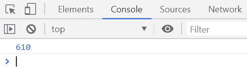
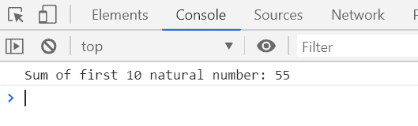

# 下划线. js _。记忆()功能

> 原文:[https://www . geesforgeks . org/下划线-js-_-memoize-function/](https://www.geeksforgeeks.org/underscore-js-_-memoize-function/)

**_。memoize()** 函数用于通过缓存函数计算的结果来记忆给定的函数。它用于加速缓慢的运行过程。

**语法:**

```
_.memoize(function, [hashFunction])
```

**参数:**该函数接受两个参数，如上所述，如下所述:

*   **功能:**需要执行的功能。
*   **有功能:**是可选参数。哈希函数用于计算存储结果的哈希键。

**返回值:**返回被调用函数的结果。

下面的例子说明了 **_。下划线中的功能:
**示例 1:****

```
<!DOCTYPE html>
<html>

<head>
    <script type="text/javascript" src=
"https://cdnjs.cloudflare.com/ajax/libs/underscore.js/1.9.1/underscore-min.js">
    </script>
</head>

<body>
    <script type="text/javascript">

        var fib = _.memoize(function (n) {
            return n < 2 ? n : fib(n - 1) + fib(n - 2);
        });

        console.log(fib(15));
    </script>
</body>

</html>
```

**输出:**


**例 2:**

```
<!DOCTYPE html>
<html>

<head>
    <script type="text/javascript" src=
"https://cdnjs.cloudflare.com/ajax/libs/underscore.js/1.9.1/underscore-min.js">
    </script>
</head>

<body>
    <script type="text/javascript">

        var sum = _.memoize(function (n) {
            return n < 1 ? n : n + sum(n - 1);
        });

        console.log('Sum of first 10 natural number: ' + sum(10));
    </script>
</body>

</html>
```

**输出:**
