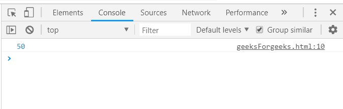
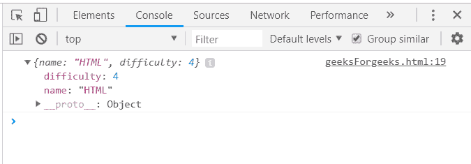
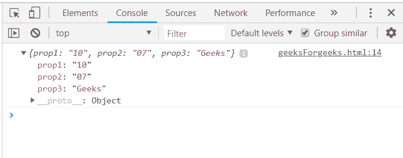
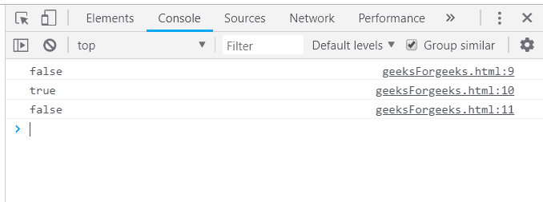

# 下划线. js _。最小功能

> 原文:[https://www.geeksforgeeks.org/underscore-js-_-min-function/](https://www.geeksforgeeks.org/underscore-js-_-min-function/)

下划线. js 是一个 JavaScript 库，它提供了许多有用的函数，在很大程度上有助于编程，比如映射、过滤、调用等，甚至不使用任何内置对象。
*_。min()* 函数用于从传递的列表中找到最小元素。如果给定了迭代，那么它将应用于每个值，并生成一个标准来对值进行排序并找到最小元素。

**语法:**

```
_.min(list, [iteratee], [context])
```

**参数:**该功能接受三个参数，如上所述，描述如下:

*   **列表:**此参数用于保存元素列表。
*   **谓词:**此参数用于保存测试条件。
*   **上下文:**此参数用于显示内容。

**返回值:**返回值是列表中最小的元素。数字列表将给出最少的数字，字符串列表将给出按字母顺序排列的第一个字符串。

**注意:**如果列表为空，则返回“无限”。

**将数字数组传递给 _。最小函数():**的。函数的作用是:将列表中的元素一个接一个地取出，然后对元素进行比较，找出列表中的最小数量。遍历并比较所有元素后。min()函数结束。

**示例:**

```
<html>
    <head>
        <script type="text/javascript" src=
        "https://cdnjs.cloudflare.com/ajax/libs/underscore.js/1.9.1/underscore.js">
        </script>
    </head>
    <body>
        <script type="text/javascript">
            var numbers = [100, 50, 400, 66, 7900];
            console.log(_.min(numbers));
        </script>
    </body>
</html>                    
```

**输出:**


**将数字和字符串的列表作为其属性传递给 _。min()函数:**传递一个数字和字符串的列表，并通过其中一个属性比较元素。通过 numbers 属性或字符串属性。就像这里比较“难度”属性一样。将返回最小难度元素。

**示例:**

```
<html>
    <head>
        <script type="text/javascript" src=
        "https://cdnjs.cloudflare.com/ajax/libs/underscore.js/1.9.1/underscore.js">
        </script>
    </head>
    <body>
        <script type="text/javascript">
            var languages = [
                    {
                    name: 'HTML',
                    difficulty: 4
                    },
                    {
                    name: 'CSS',
                    difficulty: 5
                    }
                ];
            console.log(_.min(languages, function(o)
            {
                return o.difficulty;
            }));
        </script>
    </body>
</html>                    
```

**输出:**


**将超过 1 个属性的结构传递给 _。min()函数:**首先声明数组(这里数组是‘arr’)，从众多属性中选择一个属性，在此基础上需要找到像这里‘hasLongHairs’这样的最小值。Console.log 记录存储此返回最小值的变量。

**示例:**

```
<html>
    <head>
        <script type="text/javascript" src=
        "https://cdnjs.cloudflare.com/ajax/libs/underscore.js/1.9.1/underscore.js">
        </script>
    </head>
    <body>
        <script type="text/javascript">
            var arr =  [
                {prop1:"10", prop2:"07", prop3: "Geeks"},
                {prop1:"12", prop2:"86", prop3: "for"},
                {prop1:"11", prop2:"58", prop3: "Geeks."} 
            ];
            console.log(_.min(arr, function(o){return o.prop2;}));
        </script>
    </body>
</html>                    
```

**输出:**


**将“真”和“假”作为列表的元素传递给 _。min()函数:**将“真”和“假”值传递给 _。min()函数。如果这些值在列表中出现至少一次，则最小值将被定义为“假”，否则答案将为“真”。

**示例:**

```
<html>
    <head>
        <script type="text/javascript" src=
        "https://cdnjs.cloudflare.com/ajax/libs/underscore.js/1.9.1/underscore.js">
        </script>
    </head>
    <body>
        <script type="text/javascript">
           console.log(_.min([true, false, true]));
           console.log(_.min([true, true]));
           console.log(_.min([false, false]));
        </script>
    </body>
</html>                    
```

**输出:**
