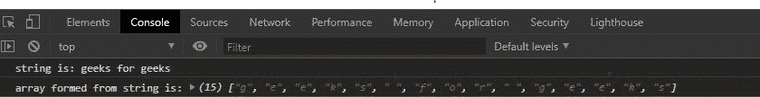
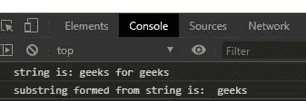

# 下划线. js _。mixin()功能

> 原文:[https://www . geesforgeks . org/下划线-js-_-mixin-function/](https://www.geeksforgeeks.org/underscore-js-_-mixin-function/)

**下划线. js** 是一个 JavaScript 库，使得对数组、字符串、对象的操作变得更加容易和便捷。 **_。mixin()** 函数用于添加额外的功能，并将全局下划线对象扩展到一些特殊的实用函数。

在浏览器中使用下划线函数之前，链接下划线 CDN 是很重要的。当链接下划线时，“_”作为一个全局变量附加到浏览器中。

**语法:**

```
_.mixin( object )
```

**参数:**该函数接受单个参数，即对象。

**返回值:**

**例 1:**

## 超文本标记语言

```
<!DOCTYPE html>
<html>

<head>
    <script src=
"https://cdnjs.cloudflare.com/ajax/libs/underscore.js/1.9.1/underscore-min.js">
    </script>
</head>

<body>
    <script>

        // Function to be binded with
        // the global "_" object
        function stringtoArray(str) {

            // Split the string to array
            return str.split("");
        }
        _.mixin({

            // Sta is a variable acronym
            // for string to array
            sta: stringtoArray
        })

        let str = "geeks for geeks";
        let arr = _.sta(str);

        console.log(`string is: ${str}`)
        console.log(
            `array formed from string is:`, arr);
    </script>
</body>

</html>
```

**输出:**



**例 2:** 如果没有参数传递给随机函数。

## 超文本标记语言

```
<!DOCTYPE html>
<html>

<head>
    <script src=
"https://cdnjs.cloudflare.com/ajax/libs/underscore.js/1.9.1/underscore-min.js">
    </script>
</head>

<body>
    <script>
        _.mixin({

            // Substring function that takes string
            // starting index and end index
            substring: (str, s, l) => {
                return str.split("").splice(s, l).join("");
            }
        })
        let str = "geeks for geeks";
        let substr = _.substring(str, 9, 6);

        // Print original string
        console.log(`string is: ${str}`)

        // Print substring
        console.log(
            `substring formed from string is:`, substr);
    </script>
</body>

</html>
```

**输出:**

