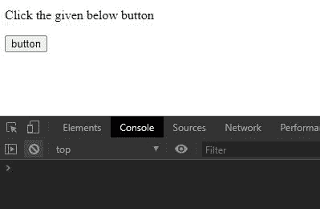
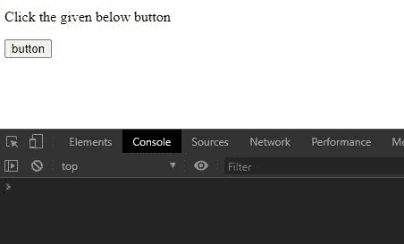
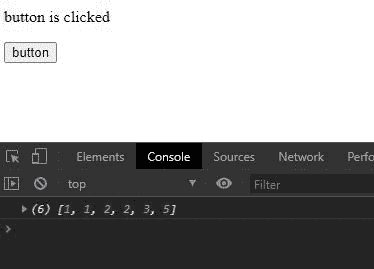

# 下划线. js _。无冲突()功能

> 原文:[https://www . geesforgeks . org/下划线-js-_-noconflict-function/](https://www.geeksforgeeks.org/underscore-js-_-noconflict-function/)

**下划线. js** 是 javascript 中的一个库，使得对数组、字符串、对象的操作变得更加容易和便捷。
国 **_。noConflict()** 函数用于创建全局下划线对象“_”对另一个变量的引用。

**注意:**在浏览器中使用下划线功能之前，链接下划线 CDN 是非常必要的。当链接下划线时，“_”作为一个全局变量附加到浏览器中。

**语法:**

```
_.noConflict()
```

**参数:**此功能不接受任何参数。

**返回值:**返回对全局下划线变量的引用。

**示例 1:** 当没有使用 noConflict()函数并使用“下划线”变量时。

## 超文本标记语言

```
<!DOCTYPE html>
<html>

<head>
    <script src=
"https://cdnjs.cloudflare.com/ajax/libs/underscore.js/1.9.1/underscore-min.js">
    </script>
</head>

<body>

<p>Click the given below button</p>

    <button>
        button
    </button>

    <script>
        let btn = document.querySelector("button");
        let p = document.querySelector("p")

        // Creating a array
        let arr = [2, 3, 1, 2, 5, 1];

        // Declaring underscore variable
        let underscore;

        // Creating a function
        let func = () => {

            // Changing text of paragraph
            // on button click
            p.innerText = "button is clicked";

            // Sorting the array
            arr = underscore.sortBy(arr,
                (e) => { return Math.round(e) })
            console.log(arr)
        }
        btn.addEventListener("click", func);
    </script>
</body>

</html>
```

**输出:**

*   **未点击按钮时:**



*   **点击按钮时:**


**例 2:** 当使用 noConflict()函数时。

## 超文本标记语言

```
<!DOCTYPE html>
<html>

<head>
    <script src=
"https://cdnjs.cloudflare.com/ajax/libs/underscore.js/1.9.1/underscore-min.js">
    </script>
</head>

<body>

<p>Click the given below button</p>

    <button>
        button
    </button>

    <script>
        let btn = document.querySelector("button");
        let p = document.querySelector("p")
        let arr = [2, 3, 1, 2, 5, 1];

        // Using underscore as a reference
        // to global _ variable
        let underscore = _.noConflict();

        // Creating a function named func`
        let func = () => {
            p.innerText = "button is clicked";
            arr = underscore.sortBy(arr,
                (e) => { return Math.round(e) })
            console.log(arr)
        }

        // Adding event listener to button
        btn.addEventListener("click", func);
    </script>
</body>

</html>
```

**输出:**

*   **未点击按钮时:**



*   **点击按钮时:**

