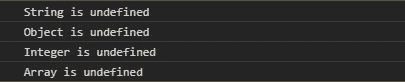
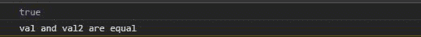
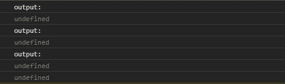

# 下划线. js _。noop()功能

> 原文:[https://www . geesforgeks . org/下划线-js-_-noop-function/](https://www.geeksforgeeks.org/underscore-js-_-noop-function/)

**下划线. js** 是一个 JavaScript 库，使得对数组、字符串、对象的操作变得更加容易和便捷。
The _ **。noop()** 函数用于返回“undefined ”,与传递给它的参数无关。

**注意:**在浏览器中使用下划线功能之前，链接下划线 CDN 是非常必要的。链接下划线时，“_”作为全局变量附加到浏览器。

**语法:**

```
_.noop();
```

**参数:**取任意类型的可选参数。

**返回值:**该函数返回未定义类型的值。

**例 1:**

```
<!DOCTYPE html>
<html>

<head>
    <script src=
"https://cdnjs.cloudflare.com/ajax/libs/underscore.js/1.9.1/underscore-min.js">
    </script>
</head>

<body>
    <script>
        let str = new String(_.noop())
        console.log(`String is ${str}`)

        let obj = new Object(_.noop())
        console.log(`Object is ${obj.Object}`)

        let int = _.noop()
        console.log(`Integer is ${int}`)

        let arr = new Array(_.noop())
        console.log(`Array is ${arr[0]}`)
    </script>
</body>

</html>
```

**输出:**



**例 2:**

```
<!DOCTYPE html>
<html>

<head>
    <script src=
"https://cdnjs.cloudflare.com/ajax/libs/underscore.js/1.9.1/underscore-min.js">
    </script>
</head>

<body>
    <script>
        let val = undefined;
        let val2 = _.noop();

        console.log(val === val2)

        if (val == val2)
            console.log(
                `val and val2 are equal`);
        else
            console.log(
                `val and val2 are not equal`);
    </script>
</body>

</html>
```

**输出:**



**示例 3:** 将参数传递给 _。noop()函数。

```
<!DOCTYPE html>
<html>

<head>
    <script src=
"https://cdnjs.cloudflare.com/ajax/libs/underscore.js/1.9.1/underscore-min.js">
    </script>
</head>

<body>
    <script>
        let func = (para1) => {
            console.log(para1)
        }
        console.log("output: ")
        func(_.noop("some value"));

        // Pass function as parameter
        console.log("output: ")
        console.log(_.noop(func))

        console.log("output: ")
        console.log(_.noop(func()))
    </script>
</body>

</html>
```

**输出:**

