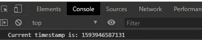
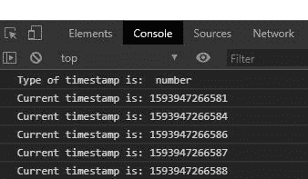

# 下划线. js _。现在()功能

> 原文:[https://www.geeksforgeeks.org/underscore-js-_-now-function/](https://www.geeksforgeeks.org/underscore-js-_-now-function/)

**下划线. js** 是 javascript 中的一个库，使得对数组、字符串、对象的操作变得更加容易和便捷。 **_。now()** 函数用于返回当前时间的时间戳。在浏览器中处理动画时，此方法会很有用。

**语法:**

```
_.now();
```

**参数:**不取参数。

**返回:**返回类型为数字。

**注意:**在浏览器中使用下划线功能之前，链接下划线 CDN 是非常必要的。当链接下划线时，“_”作为一个全局变量附加到浏览器中。

为了更好地理解函数，下面给出了几个例子。

**例 1:**

```
<!DOCTYPE html> 
<html> 
  <head> 
    <script src =  
"https://cdnjs.cloudflare.com/ajax/libs/underscore.js/1.9.1/underscore-min.js" > 
    </script> 
   </head> 
  <body>
    <script>
      console.log(`Current timestamp is: ${_.now()}`)
    </script>
  </body> 
</html>
```

**输出:**



**例 2:**

```
<!DOCTYPE html> 
<html> 
  <head> 
    <script src =  
"https://cdnjs.cloudflare.com/ajax/libs/underscore.js/1.9.1/underscore-min.js" > 
    </script> 
   </head> 
  <body>
    <script>
    //creating print function to print timestamp after delay of 10ms
      function print(){
        setTimeout(()=>{
          console.log(`Current timestamp is: ${_.now()}`)
        }, 10)
      }
      //running this function 5 times using _.times() function.
      _.times(5, print)
      console.log("Type of timestamp is: ", typeof(_.now()))
    </script>
  </body> 
</html>
```

**输出:**

