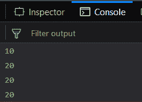
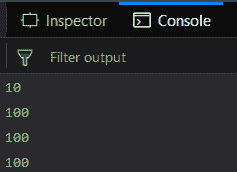
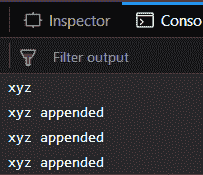
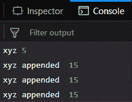

# 下划线. js _。一次()功能

> 原文:[https://www . geesforgeks . org/下划线-js-_-once-function/](https://www.geeksforgeeks.org/underscore-js-_-once-function/)

下划线. js 是一个 JavaScript 库，它提供了很多有用的功能，比如映射、过滤、调用等，甚至不使用任何内置对象。

**_。一次函数**用于我们希望某个特定函数只执行一次的情况。即使我们多次执行或调用这个函数，它也不会有任何效果。原始函数的值只会在每次调用时返回。
它主要用于 initialize()函数，该函数仅用于给变量分配初始值。

**语法:**

```
_.once(function)
```

**参数:**
只需要一个参数，即只需要调用一次的函数。

**返回值:**
每次迭代或重复调用函数时，都会返回原始调用的值。

1.  **Performing addition function with the _.once() function:**
    The function that is passed to the _.once() function adds 10 to the variable 10 which originally has 10 value. Then the _.once() function is assigned to the another function ‘startFunc()’. Then the first time the ‘startFunc()’ is called the value of ‘a’ is incremented by 10 and becomes 20\. So the output of first time calling is 20\. Then the next time when ‘startFunc()’ is called the value of ‘a’ is again supposed to be incremented by 10 but this does not happen. This is because the ‘startFunc()’ has a function ‘_.once()’ in its definition which prevents it from being executed more than one times. So, the output of the second and third calls will be the same as first, i.e., 20\. On the first line, the value of ‘a’ is getting printed before calling the ‘startFunc()’ hence the output is 10.
    **Examples:**

    ```
    <html>

    <head>
        <script src=
    "https://cdnjs.cloudflare.com/ajax/libs/underscore.js/1.9.1/underscore-min.js">
      </script>
    </head>

    <body>
        <script type="text/javascript">
            var a = 10;

            function add() {
                a += 10;
            }
            var startFunc = _.once(add);
            console.log(a);
            startFunc();
            console.log(a);
            startFunc();
            console.log(a);
            startFunc();
            console.log(a);
        </script>
    </body>

    </html>
    ```

    **输出:**
    

2.  **Performing multiplication operation with the _.once() function:**
    The function that is passed to the _.once() function multiplies by 10 the variable ‘a’ which has value 10 originally. Then the _.once() function is assigned to another function ‘startFunc()’. The first time the ‘startFunc()’ is called the value of ‘a’ is multiplied by 10 and becomes 100\. So the output of first time calling is 100\. Then the next time when ‘startFunc()’ is called the value of ‘a’ is again supposed to be again multiplied by 10 but this does not happen. This is because the ‘startFunc()’ has a function ‘_.once()’ in its definition which prevents it from being executed more than one times. So, the output of the second and third calls will be the same as first, i.e., 100\. On the first line, the value of ‘a’ is getting printed before calling the ‘startFunc()’ hence the output is 10.

    ```
    <html>

    <head>
        <script src=
    "https://cdnjs.cloudflare.com/ajax/libs/underscore.js/1.9.1/underscore-min.js">
      </script>
    </head>

    <body>
        <script type="text/javascript">
            var a = 10;

            function add() {
                a *= 10;
            }
            var startFunc = _.once(add);
            console.log(a);
            startFunc();
            console.log(a);
            startFunc();
            console.log(a);
            startFunc();
            console.log(a);
        </script>
    </body>

    </html>
    ```

    **输出:**
    

3.  **Passing strings to the _.once() function:**
    The function that is passed to the _.once() function appends the original string of the variable ‘a’ with the other string. The _.once() function is assigned to another function ‘startFunc()’. The first time the ‘startFunc()’ is called the value of ‘a’ is appended by ” appended” string and hence becomes “xyz appended”. So the output of first time calling is “xyz appended”. Then the next time when ‘startFunc()’ is called the value of ‘a’ is again supposed to be again appended but this does not happen. This is because the ‘startFunc()’ has a function ‘_.once()’ in its definition which prevents it from being executed more than one times. So, the output of the second and third calls will be the same as first, i.e., “xyz appended”. On the first line, the value of ‘a’ is getting printed before calling the ‘startFunc()’ hence the output is “xyz”.

    ```
    <html>

    <head>
        <script src=
    "https://cdnjs.cloudflare.com/ajax/libs/underscore.js/1.9.1/underscore-min.js">
      </script>
    </head>

    <body>
        <script type="text/javascript">
            var a = 'xyz';

            function add() {
                a += " appended ";
            }
            var startFunc = _.once(add);
            console.log(a);
            startFunc();
            console.log(a);
            startFunc();
            console.log(a);
            startFunc();
            console.log(a);
        </script>
    </body>

    </html>
    ```

    **输出:**
    

4.  **Passing both number and string to the _.once() function:**
    Here we perform _.once() function on a function which both appends the string to a variable ‘a’ whose original value is “xyz” and also adds 10 to a variable ‘b’ whose original value is 5\. On the first line the original values of both the variables ‘a’ and ‘b’ will be displayed. After that when we first time call the ‘startFunc()’ the ‘a’ variable is appended by ” appended” string and the ‘b’ variable’s value is incremented by 10\. So, ‘a’ becomes “xyz appended” and ‘b’ becomes 15\. Now each time the ‘startFunc()’ is used the values of ‘a’ and ‘b’ will remain same as we have use _.once() function in the definition of ‘startFunc()’.

    ```
    <html>

    <head>
        <script src=
    "https://cdnjs.cloudflare.com/ajax/libs/underscore.js/1.9.1/underscore-min.js">
      </script>
    </head>

    <body>
        <script type="text/javascript">
            var a = 'xyz',
                b = 5;

            function add() {
                a += " appended ";
                b += 10;
            }
            var startFunc = _.once(add);
            console.log(a, b);
            startFunc();
            console.log(a, b);
            startFunc();
            console.log(a, b);
            startFunc();
            console.log(a, b);
        </script>
    </body>

    </html>
    ```

    **输出:**
    

**注意:**
这些命令在 Google 控制台或 firefox 中无法工作，因为这些额外的文件需要添加，而它们没有添加。
因此，将给定的链接添加到您的 HTML 文件中，然后运行它们。
链接如下:

```
<script type="text/javascript" src =
"https://cdnjs.cloudflare.com/ajax/libs/underscore.js/1.9.1/underscore-min.js">
</script>
```