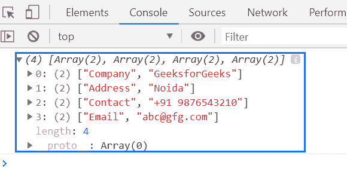
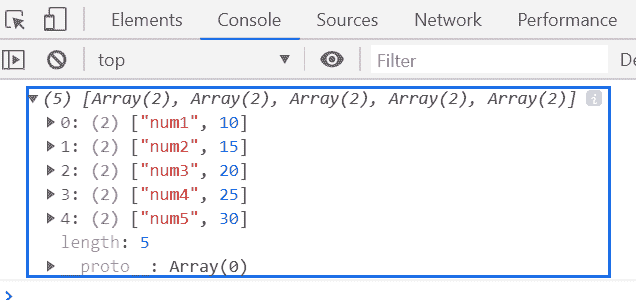

# 下划线. js _。成对()功能

> 原文:[https://www . geesforgeks . org/下划线-js-_-pairs-function/](https://www.geeksforgeeks.org/underscore-js-_-pairs-function/)

**_。pairs()函数**用于将一个对象转换成[key，value]对。

**语法:**

```
_.pairs( object )
```

**参数:**该函数接受一个参数，如上所述，如下所述:

*   **对象:**包含保存键值对元素的对象元素。

**返回值:**返回[键，值]对的列表。

**例 1:**

```
<!DOCTYPE html>
<html>

<head>
    <script type="text/javascript" 
            src=
"https://cdnjs.cloudflare.com/ajax/libs/underscore.js/1.9.1/underscore-min.js">
    </script>
</head>

<body>
    <script type="text/javascript">

        var obj = {
            Company: "GeeksforGeeks",
            Address: "Noida",
            Contact: "+91 9876543210",
            Email: "abc@gfg.com"
        }
        console.log(_.pairs(obj));
    </script>
</body>

</html>
```

**输出:**


**例 2:**

```
<!DOCTYPE html>
<html>

<head>
    <script type="text/javascript" 
            src=
"https://cdnjs.cloudflare.com/ajax/libs/underscore.js/1.9.1/underscore-min.js">
    </script>
</head>

<body>
    <script type="text/javascript">

        var objectPair = _.pairs({ num1: 10, num2: 15, num3: 20, num4: 25, num5: 30 });

        console.log(objectPair);
    </script>
</body>

</html>
```

**输出:**
