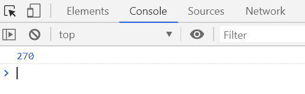
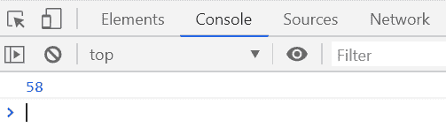

# 下划线. js _。部分()功能

> 原文:[https://www . geesforgeks . org/下划线-js-_-分部-函数/](https://www.geeksforgeeks.org/underscore-js-_-partial-function/)

**_。partial()** 函数用于通过填充函数的任意数量的参数来部分应用函数，而不改变其动态值。

**语法:**

```
_.partial(function, *arguments)
```

**参数:**该函数接受两个参数，如上所述，如下所述:

*   **功能:**需要执行的功能。
*   **参数:**这个参数需要在元素之间添加一些符号。

**返回值:**该函数返回部分执行函数的结果。

下面的例子说明了 **_。partial()函数【下划线中的 T1:
**示例 1:****

```
<!DOCTYPE html>
<html>

<head>
    <script type="text/javascript" src=
"https://cdnjs.cloudflare.com/ajax/libs/underscore.js/1.9.1/underscore-min.js">
    </script>
</head>

<body>
    <script type="text/javascript">

        var product = function (num1, num2) {
            return num1 * num2;
        };

        prod = _.partial(product, 15);
        console.log(prod(18));
    </script>
</body>

</html>
```

**输出:**


**例 2:**

```
<!DOCTYPE html>
<html>

<head>
    <script type="text/javascript" src=
"https://cdnjs.cloudflare.com/ajax/libs/underscore.js/1.9.1/underscore-min.js">
    </script>
</head>

<body>
    <script type="text/javascript">

        var sum = function (num1, num2, num3) {
            return num1 + num2 + num3;
        };

        sum = _.partial(sum, 15, 25);
        console.log(sum(18));
    </script>
</body>

</html>
```

**输出:**
