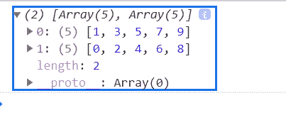
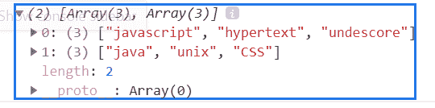

# 下划线. js _。分区功能

> 原文:[https://www . geesforgeks . org/下划线-js-_-分区-函数/](https://www.geeksforgeeks.org/underscore-js-_-partition-function/)

_。partition()函数用于获取一个数组作为输入，并返回两个数组。第一个数组包含满足谓词(条件)的元素，第二个数组包含剩余的元素。

**语法:**

```
_.partition(list, predicate)
```

**参数:**该函数接受两个参数，如上所述，如下所述:

*   **列表:**此参数保存项目列表。
*   **谓词:**此参数保存真值条件。

**返回值:**该函数根据谓词条件返回两个分开的数组。

**例 1:**

```
<!DOCTYPE html>
<html>

<head>
    <script type="text/javascript" src=
"https://cdnjs.cloudflare.com/ajax/libs/underscore.js/1.9.1/underscore-min.js">
    </script>
</head>

<body>
    <script type="text/javascript">
        (function () {
            var arr = [0, 1, 2, 3, 4, 5, 6, 7, 8, 9];

            var division = _.partition(arr, function (element) {
                return element % 2 != 0;
            });

            console.log(division);
        }());
    </script>
</body>

</html>
```

**输出:**


**例 2:**

```
<!DOCTYPE html>
<html>

<head>
    <script type="text/javascript" src=
"https://cdnjs.cloudflare.com/ajax/libs/underscore.js/1.9.1/underscore-min.js">
    </script>
</head>

<body>
    <script type="text/javascript">
        (function () {
            var words = ["javascript", "java", "unix",
                         "hypertext", "undescore", "CSS"];

            var part = _.partition(words, function (element) {
                return element.length > 4;
            });

            console.log(part);
        }());
    </script>
</body>

</html>
```

**输出:**
