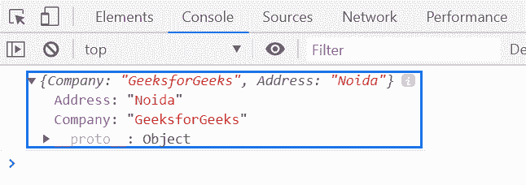
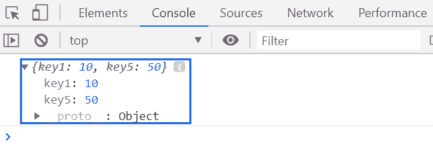

# 下划线. js | _。pick()功能

> 原文:[https://www . geesforgeks . org/下划线-js-_-pick-function/](https://www.geeksforgeeks.org/underscore-js-_-pick-function/)

**_。pick()函数**用于返回使用给定键过滤的对象的副本。该函数接受一个谓词，该谓词指示从对象中选取哪些键。

**语法:**

```
_.pick(object, *keys)
```

**参数:**该函数接受两个参数，如上所述，如下所述:

*   **对象:**此参数保存对象的值。
*   **键:**为可选参数。它包含需要选取值的键名。

**返回值:**返回使用给定关键字过滤的对象的副本。

**例 1:**

```
<!DOCTYPE html>
<html>

<head>
    <script type="text/javascript" src=
"https://cdnjs.cloudflare.com/ajax/libs/underscore.js/1.9.1/underscore-min.js">
    </script>
</head>

<body>
    <script type="text/javascript">

        var info = {
            Company: 'GeeksforGeeks',
            Address: 'Noida',
            Contact: '+91 9876543210'
        };

        console.log(_.pick(info, 'Company', 'Address'));
    </script>
</body>

</html>
```

**输出:**


**例 2:**

```
<!DOCTYPE html>
<html>

<head>
    <script type="text/javascript" src=
"https://cdnjs.cloudflare.com/ajax/libs/underscore.js/1.9.1/underscore-min.js">
    </script>
</head>

<body>
    <script type="text/javascript">

        var info = {
            key1: 10,
            key2: 20,
            key3: 30,
            key4: 40,
            key5: 50
        };

        console.log(_.pick(info, function (value, key, info) {
            return value == 10 || value == 50;
        }));
    </script>
</body>

</html>
```

**输出:**
