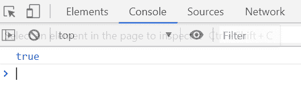
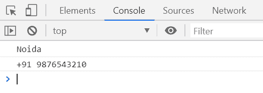

# 下划线. js | _。属性()功能

> 原文:[https://www . geesforgeks . org/下划线-js-_-属性-函数/](https://www.geeksforgeeks.org/underscore-js-_-property-function/)

**_。property()函数**用于返回一个函数，该函数将返回任何传入对象的指定属性。

**语法:**

```
_.property( path )
```

**参数:**该函数接受一个参数，如上所述，如下所述:

*   **路径:**此参数保存一个简单的键或数组索引或一个对象键数组。

**返回值:**它返回一个函数，该函数将返回一个对象的指定属性。

**例 1:**

```
<!DOCTYPE html>
<html>

<head>
    <script type="text/javascript" src=
"https://cdnjs.cloudflare.com/ajax/libs/underscore.js/1.9.1/underscore-min.js">
    </script>
</head>

<body>
    <script type="text/javascript">

        var info = {
            Company: 'GeeksforGeeks',
            Address: 'Noida',
            Contact: '+91 9876543210'
        };

        console.log(_.property('Company')(info) === 'GeeksforGeeks');
    </script>
</body>

</html>
```

**输出:**


**例 2:**

```
<!DOCTYPE html>
<html>

<head>
    <script type="text/javascript" src=
"https://cdnjs.cloudflare.com/ajax/libs/underscore.js/1.9.1/underscore-min.js">
    </script>
</head>

<body>
    <script type="text/javascript">

        var info = {
            Company: { name: 'GeeksforGeeks' },
            Contact: { Address: 
                { 
                    AddressInfo: 'Noida', 
                    ContNo: '+91 9876543210' 
                } 
            }
        };

        var propInfo = _.property(['Contact', 'Address', 'AddressInfo', ]);
        console.log(propInfo(info));

        var propInfo = _.property(['Contact', 'Address', 'ContNo', ]);
        console.log(propInfo(info));
    </script>
</body>

</html>
```

**输出:**
