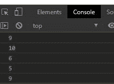
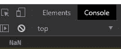
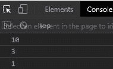

# 下划线. js _。随机()功能

> 原文:[https://www . geesforgeks . org/下划线-js-_-random-function/](https://www.geeksforgeeks.org/underscore-js-_-random-function/)

**下划线. js** 是 javascript 中的一个库，使得对数组、字符串、对象的操作变得更加容易和便捷。
国 **_。random()** 函数用于返回一个随机整数，该整数在提供给函数的范围内。

**注意:**在浏览器中使用下划线功能之前，链接下划线 CDN 是非常必要的。当链接下划线时，“_”作为一个全局变量附加到浏览器中。

**语法:**

```
_.random(min, max);
```

**参数:**取以下参数。

*   **最小值:**是函数返回的最小随机值。
*   **最大值:**是函数可以返回的最大随机值。**T3】**

**返回值:**返回一个介于最小值和最大值之间的随机整数。如果只传递了一个值，那么它将返回介于 0 和传递值之间的随机值。

**例 1:**

```
<!DOCTYPE html>
<html>

<head>
    <script src=
"https://cdnjs.cloudflare.com/ajax/libs/underscore.js/1.9.1/underscore-min.js">
    </script>
</head>

<body>
    <script>
        let min = 5;
        let max = 10;

        // Printing 5 random values
        // in range 5 and 10
        for (let i = 0; i < 5; i++) {
            console.log(_.random(min, max));
        }
    </script>
</body>

</html>
```

**输出:**



**例 2:** 如果随机函数没有参数。

```
<!DOCTYPE html>
<html>

<head>
    <script src=
"https://cdnjs.cloudflare.com/ajax/libs/underscore.js/1.9.1/underscore-min.js">
    </script>
</head>

<body>
    <script>

        // Without passing any 
        // value to function
        console.log(_.random())
    </script>
</body>

</html>
```

**输出:**



**例 3:** 当只给定一个参数时，随机值在 0 到 n 的范围内，其中 n 是给定的参数。

```
<!DOCTYPE html>
<html>

<head>
    <script src=
"https://cdnjs.cloudflare.com/ajax/libs/underscore.js/1.9.1/underscore-min.js">
    </script>
</head>

<body>
    <script>
        console.log(_.random(10))
        console.log(_.random(5))
        console.log(_.random(8))
    </script>
</body>

</html>
```

**输出:**

