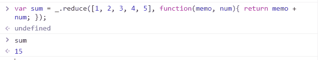
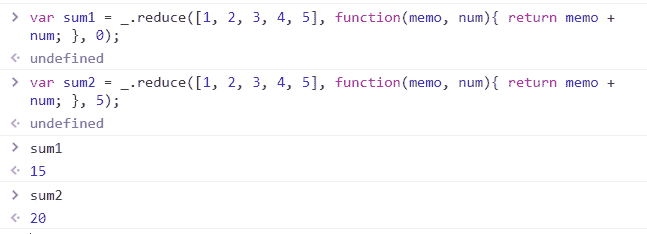
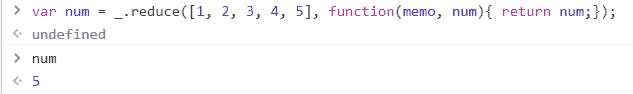
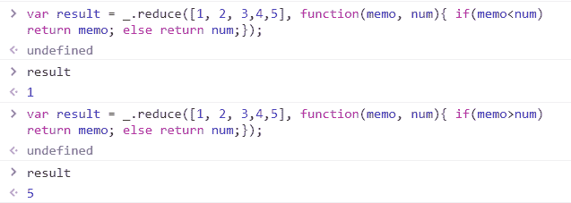

# 下划线. js _。减少()功能

> 原文:[https://www . geesforgeks . org/下划线-js-_-reduce-function/](https://www.geeksforgeeks.org/underscore-js-_-reduce-function/)

**_。reduce()** 函数是下划线. js 中的一个内置函数，用于将数组/对象的属性转换为单个值，或者用于从给定的值列表中创建单个结果。当列表中的所有元素都被传递给函数/迭代，并且没有剩余的元素时，那么 _。每个循环结束。
迭代函数利用记忆，即每次计算一个值时都记住返回值。

**语法:**

```
_.reduce(list, iteratee, memo)
```

**参数:**该函数接受三个参数，如上所述，如下所述:

*   **列表:**是包含一些元素的列表。
*   **迭代:**是用来取列表中所有元素的函数，也记住了所有返回值。
*   **备忘录:**是数值。

**返回值:**它返回最后一次迭代的值是由 _。reduce()函数。

**显示 _ 工作状态的 JavaScript 代码。减少()功能**

**1)将数字列表传递给 _。reduce()函数:**的。_reduce()函数从列表中逐个取出元素，并对代码执行指定的操作。像这里一样，操作是添加列表的元素。添加所有元素后，reduce 函数结束。这里，memo 的起始值取为“0”。

```
<html>

<head>
    <script>
        <src = "https://cdnjs.cloudflare.com/ajax/libs/
                underscore.js/1.9.1/underscore-min.js" >
    </script>
    <script type="text/javascript"
    src="https://cdnjs.cloudflare.com/ajax/libs/underscore.js
         /1.9.1/underscore-min.js.map"></script>

    <script type="text/javascript"
     src="https://cdnjs.cloudflare.com/ajax/libs/underscore.js
          /1.9.1/underscore.js"></script>
</head>

<body>
    <script type="text/javascript">
          var sum=_.reduce([1, 2, 3, 4, 5], function(memo, num) {
               return memo + num; 
          });
          document.write(sum);   
    </script>
</body>

</html>
```

**输出:**

**2)传递和不传递 memo 的值:**如果我们不传递 memo 变量的值，那么它会取列表中第一个元素的值。否则，它会采用上述值。

```
<html>

<head>
    <script>
        <src = "https://cdnjs.cloudflare.com/ajax/libs/
                underscore.js/1.9.1/underscore-min.js" >
    </script>
    <script type="text/javascript"
    src="https://cdnjs.cloudflare.com/ajax/libs/underscore.js
         /1.9.1/underscore-min.js.map"></script>

    <script type="text/javascript"
     src="https://cdnjs.cloudflare.com/ajax/libs/underscore.js
          /1.9.1/underscore.js"></script>
</head>

<body>
    <script type="text/javascript">
         var sum1 = _.reduce([1, 2, 3, 4, 5], function(memo, num){ 
               return memo + num;  
         0 });
         var sum2 = _.reduce([1, 2, 3, 4, 5], function(memo, num){ 
               return memo + num;  
         5 });
         document.write(sum1);
         document.write(sum);
    </script>
</body>

</html>
```

**输出:**

**3)找出 num 变量的值:**num 变量是存储列表元素值的变量。因此，因为我们在函数结束时返回值，所以，这意味着列表也结束了。因此，将打印列表的最后一个元素。

```
<html>

<head>
    <script>
        <src = "https://cdnjs.cloudflare.com/ajax/libs/
                underscore.js/1.9.1/underscore-min.js" >
    </script>
    <script type="text/javascript"
    src="https://cdnjs.cloudflare.com/ajax/libs/underscore.js
         /1.9.1/underscore-min.js.map"></script>

    <script type="text/javascript"
     src="https://cdnjs.cloudflare.com/ajax/libs/underscore.js
          /1.9.1/underscore.js"></script>
</head>

<body>
    <script type="text/javascript">
         var num=_.reduce([1, 2, 3, 4, 5], function(memo, num) {
              return num;
          });
         document.write(num);
    </script>
</body>

</html>
```

**输出:**


**4)将逻辑运算符应用于 _。reduce()函数:**从上面的例子中我们可以清楚地看到，在 memo 的值是 1，num 的值是 5(仅针对本例)。因此，我们可以应用逻辑运算符(>、<)来比较 num 和 memo 的值，然后打印它们的值。

```
<html>

<head>
    <script>
        <src = "https://cdnjs.cloudflare.com/ajax/libs/
                underscore.js/1.9.1/underscore-min.js" >
    </script>
    <script type="text/javascript"
    src="https://cdnjs.cloudflare.com/ajax/libs/underscore.js
         /1.9.1/underscore-min.js.map"></script>

    <script type="text/javascript"
     src="https://cdnjs.cloudflare.com/ajax/libs/underscore.js
          /1.9.1/underscore.js"></script>
</head>

<body>
    <script type="text/javascript">
         var result=_.reduce([1, 2, 3, 4, 5], function(memo, num) {
               if(memo<num)
                    return memo;
               else
                    return num;
         });
    </script>
</body>

</html>
```

**输出:** 