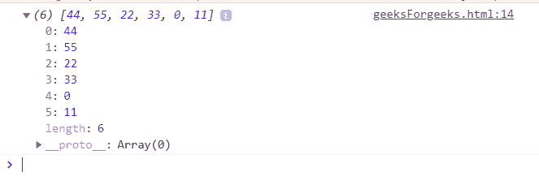
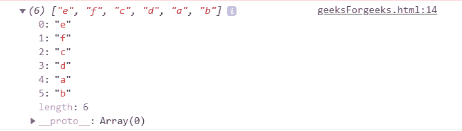
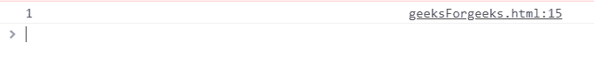
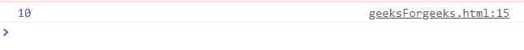

# 下划线. js _。减速右()功能

> 原文:[https://www . geesforgeks . org/下划线-js-_-reduceright-function/](https://www.geeksforgeeks.org/underscore-js-_-reduceright-function/)

**_。reduceRight()** 函数是下划线. js 中的一个内置方法，用于从右开始对列表中的每个元素执行操作。当列表中的所有元素都从右向左传递给函数/迭代，并且没有更多的元素剩下时，那么 _。减少右循环结束。

它对数组的两个值(从右到左)同时应用一个函数，以便将其减少到一个值。

**语法:**

```
_.reduceRight(list, function())

```

**参数:**它接受以下指定的两个参数-

*   **列表:**是包含一些从右向左访问的元素的列表。
*   **功能:**是执行从右向左缩小列表元素形式的操作的功能。

**返回值:**从右向左返回列表表单的缩减元素。

**显示 _ 工作状态的 JavaScript 代码。reduceRight()功能:**

1.  **Passing a list of numbers to _.reduceRight() function:** The ._reduceRight() function takes the element from the list one by one and do the specified operations on the code. Like here the operation is concatenation of the elements of the list to form a new list. After concatenating all the elements, the reduceRight function ends.

    ```
    <html>

    <head>
        <script type="text/javascript" src ="https://cdnjs.cloudflare.com/ajax/
                          libs/underscore.js/1.9.1/underscore-min.js"></script>
        <script type="text/javascript" src="https://cdnjs.cloudflare.com/ajax/
                          libs/underscore.js/1.9.1/underscore-min.js.map"></script>
        <script type="text/javascript" src="https://cdnjs.cloudflare.com/ajax/
                          libs/underscore.js/1.9.1/underscore.js"></script>
    </head>

    <body>
        <script type="text/javascript">
              var list = [[00, 11], [22, 33], [44, 55]];
              var answer = _.reduceRight(list, function(a, b)
                              { return a.concat(b); }, []);
              document.write(answer);   
        </script>
    </body>

    </html>
    ```

    **输出:**
    

2.  **Passing a list of characters to the _.reduceRight() function :** Here also we are doing the same thing as done in the 1st example. The difference is that, the list id not of numbers rather than of characters. So, the final list will contain all the characters but in right to left order of the original list.

    ```
    <html>

    <head>
        <script type="text/javascript" src ="https://cdnjs.cloudflare.com/ajax/
                         libs/underscore.js/1.9.1/underscore-min.js"></script>
        <script type="text/javascript" src="https://cdnjs.cloudflare.com/ajax/
                         libs/underscore.js/1.9.1/underscore-min.js.map"></script>
        <script type="text/javascript" src="https://cdnjs.cloudflare.com/ajax/
                         libs/underscore.js/1.9.1/underscore.js"></script>
    </head>

    <body>
        <script type="text/javascript">
              var list = [['a', 'b'], ['c', 'd'], ['e', 'f']];
              var answer = _.reduceRight(list, function(a, b)
                               { return a.concat(b); }, []);
              document.write(answer);      
        </script>
    </body>

    </html>
    ```

    **输出:**
    

3.  **Finding out the value of the last iteration:** The ‘num’ variable is a variable which stores the values of the list elements. Therefore since we are returning the value at the end when the function gets over, so, this implies that the list is also over. And since the list is traversed from right to left so the result will be the leftmost element.

    ```
    <html>

    <head>
        <script type="text/javascript" src ="https://cdnjs.cloudflare.com/ajax/
              libs/underscore.js/1.9.1/underscore-min.js"></script>
        <script type="text/javascript" src="https://cdnjs.cloudflare.com/ajax/
              libs/underscore.js/1.9.1/underscore-min.js.map"></script>
        <script type="text/javascript" src="https://cdnjs.cloudflare.com/ajax/
              libs/underscore.js/1.9.1/underscore.js"></script>
    </head>

    <body>
        <script type="text/javascript">
              var number=_.reduceRight([1, 2, 3, 4, 5],
                       function(memo, num) {
                  return num;
              });
              document.write(number);   
        </script>
    </body>

    </html>
    ```

    **输出:**
    

4.  **Applying arithmetic operators in the _.reduceRight() function:** If we try to perform any arithmetic operation like addition etc on the list of the elements then the first element will be from the Rightmost side.

    ```
    <html>

    <head>
        <script type="text/javascript" src ="https://cdnjs.cloudflare.com/ajax/
                    libs/underscore.js/1.9.1/underscore-min.js"></script>
        <script type="text/javascript" src="https://cdnjs.cloudflare.com/ajax/
                    libs/underscore.js/1.9.1/underscore-min.js.map"></script>
        <script type="text/javascript" src="https://cdnjs.cloudflare.com/ajax/
                    libs/underscore.js/1.9.1/underscore.js"></script>
    </head>

    <body>
        <script type="text/javascript">
              var sum=[0, 1, 2, 3, 4].reduceRight(function(a, c ) {
              return a + c;
              });
              document.write(sum);  
        </script>
    </body>

    </html>
    ```

    **输出:**
    