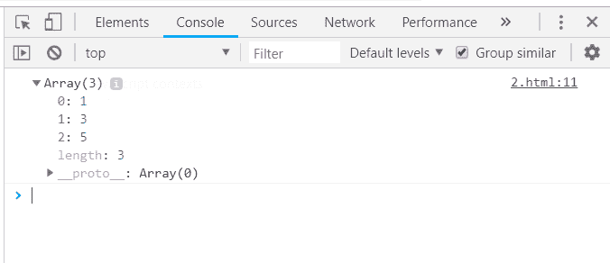
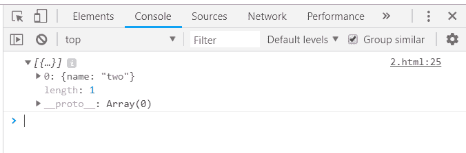
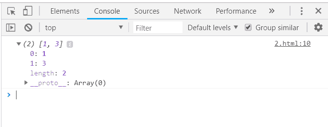
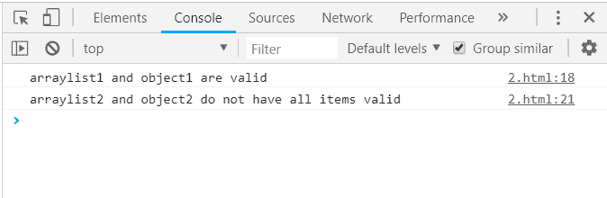

# 下划线. js _。剔除功能

> 原文:[https://www . geesforgeks . org/下划线-js-_-拒绝-函数/](https://www.geeksforgeeks.org/underscore-js-_-reject-function/)

下划线. js 是一个 JavaScript 库，它提供了许多有用的函数，在很大程度上有助于编程，比如映射、过滤、调用等，甚至不使用任何内置对象。
The _。reject()函数用于给出与给定条件不匹配的答案。它用于从列表中找出那些不满足给定条件的元素，然后只对它们进行更改。当列表中的所有元素都被传递给函数/迭代，并且没有剩余的元素时，那么 _。reject()循环结束。它与 _ 相反。filter()函数作为过滤器选择那些满足给定条件的项目。

**语法:**

```
_.reject( list, predicate, [context] )
```

**参数:**该功能接受三个参数，如上所述，描述如下:

*   **列表:**此参数包含元素列表。
*   **谓词:**该参数包含用于拒绝元素的条件。
*   **上下文:**是用来显示的文本。它是可选参数。

**返回值:**该函数返回不满足条件的元素数组。拒绝()功能。

**将数字列表传递给 _。拒绝()功能:**的。_reject()函数从列表中逐个取出元素，并对代码进行操作。下面是从列表中查找奇数元素的示例。

**示例:**

```
<html>
    <head>
        <script type="text/javascript" src = 
        "https://cdnjs.cloudflare.com/ajax/libs/underscore.js/1.9.1/underscore-min.js" >
        </script>
        <script type="text/javascript"
         src="https://cdnjs.cloudflare.com/ajax/libs/underscore.js/1.9.1/underscore.js">
         </script>
    </head>

    <body>
        <script type="text/javascript">
              var odds = _.reject([1, 2, 3, 4, 5, 6], 
                           function(num){ return num % 2 == 0; });
              console.log(odds); 
        </script>
    </body> 
</html>
```

**输出:**


**将结构传递给 _。拒绝()功能:**选择将应用条件的项目的一个属性。下面使用了“禁用”属性。因为“item2”没有禁用属性，所以它被拒绝并作为输出给出。

**示例:**

```
<html> 
    <head>
        <script type="text/javascript" src = 
        "https://cdnjs.cloudflare.com/ajax/libs/underscore.js/1.9.1/underscore-min.js">
        </script>
        <script type="text/javascript"
         src="https://cdnjs.cloudflare.com/ajax/libs/underscore.js/1.9.1/underscore.js">
         </script>
    </head> 
    <body>
        <script type="text/javascript">
             var data = {
                stuff: {
                    item1: {
                        name: "one",
                        disabled: true
                    },
                  item2: {
                        name: "two"
                    }
                }
            };
            data.stuff = _.reject(data.stuff, function(val) {
                return val.disabled;
            });
        console.log(data.stuff);
        </script>
    </body>
</html>
```

**输出:**


**传递数字列表和与项目匹配的值:**数组中与给定数字不匹配的元素被拒绝，因此在输出中显示为数组。

**示例:**

```
<html>
    <head>
        <script type="text/javascript" src = 
        "https://cdnjs.cloudflare.com/ajax/libs/underscore.js/1.9.1/underscore-min.js" >
        </script>
        <script type="text/javascript" src = 
        "https://cdnjs.cloudflare.com/ajax/libs/underscore.js/1.9.1/underscore.js"></script>
    </head>      
    <body>
        <script type="text/javascript">
             console.log( _.reject({one: 1, two: 2, three: 3}, function(val, key){
                  return val === 2;
             }));
        </script>
    </body>  
</html>
```

**输出:**


**使用两个 _。一起拒绝()功能:**将不同的对象传递给每个 _。reject()函数，然后通过使用像 *& &、||、！*等。这里，两个对象和两个数组列表都被拒绝，因为它们不满足给定的条件，所以它们作为输出给出。

**示例:**

```
<html>  
    <head>
        <script type="text/javascript" src = 
        "https://cdnjs.cloudflare.com/ajax/libs/underscore.js/1.9.1/underscore-min.js" >
        </script>
        <script type="text/javascript" src = 
        "https://cdnjs.cloudflare.com/ajax/libs/underscore.js/1.9.1/underscore.js">
        </script>
    </head>  
    <body>
        <script type="text/javascript">
             var arraylist1 = [true];
             var arraylist2 = [null, {} , undefined, {}];
             var object1 = {prop1: true};
             var object2 = {
                    prop1: null,
                    prop2: true,prop3: true,
             }; 
             if (_.reject(arraylist1) && _.reject(object1)) {
                    console.log('arraylist1 and object1 are valid');
             }
             if (_.reject(arraylist2) && _.reject(object2)) {
                    console.log('arraylist2 and object2 do not have all items valid');
             }
        </script>
    </body>  
</html>
```

**输出:**
