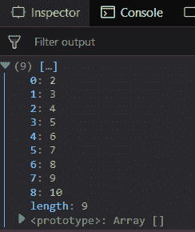
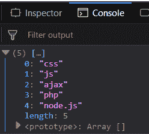
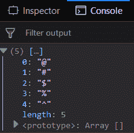
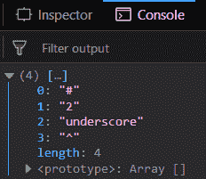

# 下划线. js _。休息()功能

> 原文:[https://www . geesforgeks . org/下划线-js-_-rest-function/](https://www.geeksforgeeks.org/underscore-js-_-rest-function/)

下划线. js 是一个 JavaScript 库，它提供了很多有用的功能，比如映射、过滤、调用等，甚至不使用任何内置对象。
The _。rest()用于返回除第零个索引元素之外的其余元素。第二个参数用于从给定的索引数组开始搜索。它用于返回所有数组元素。当元素出现时，除了索引的第一个元素之外，只显示它们。

**语法:**

```
_.rest( array, [index] ) 
```

**参数:**该函数接受两个参数，如下所示:

*   **数组:**此参数用于保存数组元素。
*   **指数:**此参数用于保存指数。

**返回值:**返回数组中剩余的元素。

**将数字数组传递给 _。rest()功能:**该。_rest()函数从列表中逐个取出元素，并直接显示元素。然后将数字元素赋予 _。rest()函数。它忽略数组中的第一个元素，然后显示所有其他元素。

**示例:**

```
<!DOCTYPE html>
<html>
    <head>
        <script src = 
"https://cdnjs.cloudflare.com/ajax/libs/underscore.js/1.9.1/underscore-min.js" >
        </script>
    </head>
    <body>
        <script type="text/javascript">
            console.log(_.rest([1, 2, 3, 4, 5, 6, 7, 8, 9, 10]));
        </script>
    </body>
</html>                    
```

**输出:**


**将字数组传递给 _。rest()功能:**该。_rest()函数从列表中逐个取出元素，直接显示元素。它忽略函数是采用编号数组还是字符数组或任何其他数组。然后将数字元素赋予 _。rest()函数。它忽略数组中的第一个元素，然后显示所有其他元素。

**示例:**

```
<!DOCTYPE html>
<html>
    <head>
        <script src = 
"https://cdnjs.cloudflare.com/ajax/libs/underscore.js/1.9.1/underscore-min.js" >
        </script>
    </head>
    <body>
        <script type="text/javascript">
            console.log(_.rest(['html', 'css', 'js', 
                        'ajax', 'php', 'node.js']));
        </script>
    </body>
</html>                    
```

**输出:**


**将特殊字符数组传递给 _。rest()功能:**该。_rest()函数从列表中一个接一个地获取元素，并直接显示元素，尽管它包含特殊字符。然后将字符元素赋予 _。rest()函数。它忽略数组中的第一个元素，然后显示所有其他元素。

**示例:**

```
<!DOCTYPE html>
<html>
    <head>
        <script src = 
"https://cdnjs.cloudflare.com/ajax/libs/underscore.js/1.9.1/underscore-min.js" >
        </script>
    </head>
    <body>
        <script type="text/javascript">
            console.log(_.rest(['!', '@', '#', '{content}apos;, '%', '^']));
        </script>
    </body>
</html>                    
```

**输出:**


**将第二个参数传递给 _。rest()函数:**第二个参数用于开始显示该索引中的元素。它用于忽略多个数组元素，因为默认情况下会忽略一个元素。其他元素也是如此。

**示例:**

```
<!DOCTYPE html>
<html>
    <head>
        <script src = 
"https://cdnjs.cloudflare.com/ajax/libs/underscore.js/1.9.1/underscore-min.js" >
        </script>
    </head>
    <body>
        <script type="text/javascript">
            console.log(_.rest(['1', 'javascript', '#',
                            '2', 'underscore', '^'], 2));
        </script>
    </body>
</html>                    
```

**输出:**


**注意:**这些命令在 Google 控制台或 Firefox 中无法工作，因为需要添加这些他们没有添加的附加文件。因此，将给定的链接添加到您的 HTML 文件中，然后运行它们。

```
<script type="text/javascript" src =  
"https://cdnjs.cloudflare.com/ajax/libs/underscore.js/1.9.1/underscore-min.js">  
</script> 
```