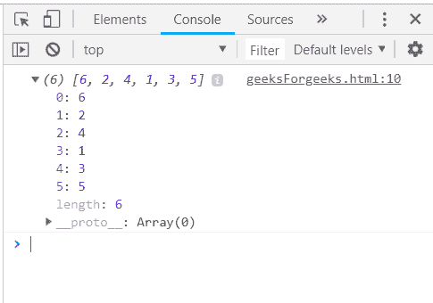
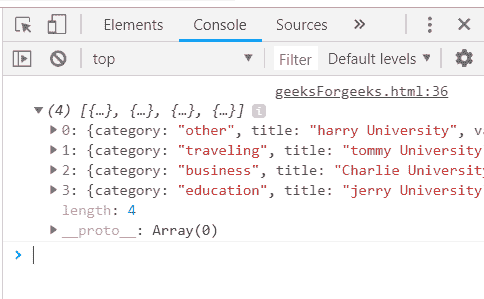
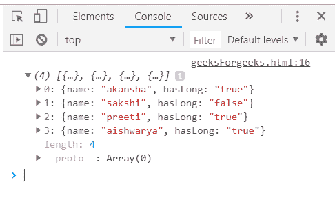
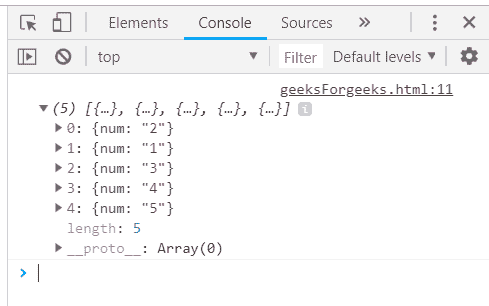

# 下划线. js _。洗牌功能

> 原文:[https://www . geesforgeks . org/下划线-js-_-shuffle-function/](https://www.geeksforgeeks.org/underscore-js-_-shuffle-function/)

下划线. js 是一个 JavaScript 库，它提供了许多有用的函数，在很大程度上有助于编程，比如映射、过滤、调用等，甚至不使用任何内置对象。
The _。shuffle()函数用于以随机方式排列数组列表。这个 _。shuffle()下划线函数使用 [Fisher Yates Shuffle](https://www.geeksforgeeks.org/shuffle-a-given-array/) ，这将在下面提到的文章中讨论。因此，每次我们使用这个函数时，根据费希尔耶茨洗牌法，这个函数的输出会有所不同。

**语法:**

```
_.shuffle(list)
```

**参数:**该功能接受单参数*列表*。此参数用于保存将被洗牌的项目列表。

**返回值:**返回值是新的随机化数组，包含传递给 _ 的原始数组中的所有元素。shuffle()函数。

**将数值数组传递给 _。shuffle()函数:** The。_shuffle()函数从列表中逐个取出元素，并根据 fisher Yates Shuffle 执行指定的操作。然后 console.log()给出最终答案，它将包含随机化问题中原始数组的所有元素。

**示例:**

```
<html>
    <head>
        <script src = 
        "https://cdnjs.cloudflare.com/ajax/libs/underscore.js/1.9.1/underscore-min.js" >
        </script>
    </head>
    <body>
        <script type="text/javascript">
            console.log(_.shuffle(_.shuffle([1, 2, 3, 4, 5, 6])));
        </script>
    </body>
</html>                    
```

**输出:**


**将结构传递给 _。shuffle()函数:**将结构传递给 _。shuffle()函数。首先像这里一样声明数组，数组是“目标”，然后将这个数组传递给 _。shuffle()函数。“目标”数组的元素将与其所有属性一起被打乱。

**示例:**

```
<html>
    <head>
        <script src = 
        "https://cdnjs.cloudflare.com/ajax/libs/underscore.js/1.9.1/underscore-min.js" >
        </script>
    </head>
    <body>
        <script type="text/javascript">
             var goal  = [
            {
                "category" : "other",
                "title" : "harry University",
                "value" : 50000,
                "id":"1"
            },
            {
                "category" : "traveling",
                "title" : "tommy University",
                "value" : 50000,
                "id":"2"
            },
            {
                "category" : "education",
                "title" : "jerry University",
                "value" : 50000,
                "id":"3"
            },
            {    
                "category" : "business",
                "title" : "Charlie University",
                "value" : 50000,
                "id":"4"
            }
        ]
        console.log(_.shuffle(goal));
        </script>
    </body>
</html>
```

**输出:**


**将一个属性为真/假的列表传递给 _。shuffle()函数:**首先声明数组(这里数组是‘人’)。选择一个需要检查的条件，如这里的“hasLongHairs”。记录最终答案。最终的答案将是一个随机数组，因为费希尔耶茨洗牌算法中使用了随机函数。

**示例:**

```
<html>
    <head>
        <script src = 
        "https://cdnjs.cloudflare.com/ajax/libs/underscore.js/1.9.1/underscore-min.js" >
        </script>
    </head>
    <body>
        <script type="text/javascript">
             var people = [
            {"name": "sakshi", "hasLong": "false"},
            {"name": "aishwarya", "hasLong": "true"},
            {"name": "akansha", "hasLong": "true"},
            {"name": "preeti", "hasLong": "true"}
        ]
         console.log(_.shuffle(people, 'name'));
        </script>
    </body>
</html>
```

**输出:**


**声明一个数组，然后将其传递给 _。shuffle()函数:**声明一个数组让属性为‘num’的‘users’通过，然后将它传递给 _。shuffle()函数。然后控制台。记录新的随机数组。每次运行输出都会有所不同。

**示例:**

```
<html>
    <head>
        <script src = 
        "https://cdnjs.cloudflare.com/ajax/libs/underscore.js/1.9.1/underscore-min.js" >
        </script>
    </head>
    <body>
        <script type="text/javascript">
             var users = [{"num":"1"}, {"num":"2"}, {"num":"3"}, {"num":"4"}, {"num":"5"}];
        console.log(_.shuffle(users, 'id'));
        </script>
    </body>
</html>
```

**输出:**
