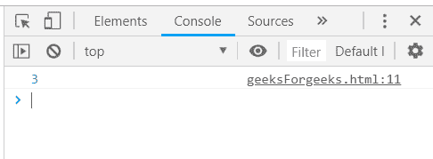
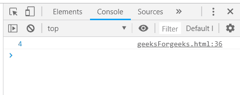
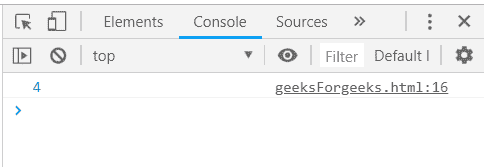
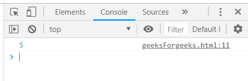

# 下划线. js _。尺寸功能

> 原文:[https://www . geesforgeks . org/下划线-js-_-size-function/](https://www.geeksforgeeks.org/underscore-js-_-size-function/)

下划线. js 是一个 JavaScript 库，它提供了许多有用的函数，在很大程度上有助于编程，比如映射、过滤、调用等，甚至不使用任何内置对象。
The _。size()函数用于求数组的大小，即数组中元素的个数。它主要用于查找数组中的元素数量。

**语法:**

```
_.size( list ) 
```

**参数:**该功能接受单参数*列表*，用于保存项目列表。

**返回值:**该函数返回一个值，该值是传递的数组的大小。

**将数组传递给 _。size()函数:**该。函数的作用是:从列表中一个接一个地获取元素，并通过从零开始计算元素的大小，并在元素通过每个元素时递增 1。传递一个数组，该数组首先具有属性名，然后将元素作为数组的一个元素。如果没有提到属性名，那么 _。size()函数将不起作用。

**示例:**

```
<!DOCTYPE html>
<html>
    <head>
        <script src = 
"https://cdnjs.cloudflare.com/ajax/libs/underscore.js/1.9.1/underscore-min.js" >
        </script>
    </head>
    <body>
        <script type="text/javascript">
            var list = [1, 2, 3, 4, 5];
            console.log(_.size(list));
        </script>
    </body>
</html>                    
```

**输出:**


**将一个由大量属性组成的数组传递给 _。size()函数:**将一个大数组传递给 _。size()函数。_。size()函数接受一个有 4 个属性的数组，“类别”、“标题”、“值”和“id”。然后应用 _。函数，console.log()将显示最终结果。

**示例:**

```
<!DOCTYPE html>
<html>
    <head>
        <script src = 
"https://cdnjs.cloudflare.com/ajax/libs/underscore.js/1.9.1/underscore-min.js" >
        </script>
    </head>
    <body>
        <script type="text/javascript">
            var goal = [
            {
                "category" : "other",
                "title" : "harry University",
                "value" : 50000,
                "id":"1"
            },
            {
                "category" : "traveling",
                "title" : "tommy University",
                "value" : 50000,
                "id":"2"
            },
            {
                "category" : "education",
                "title" : "jerry University",
                "value" : 50000,
                "id":"3"
            },
            { 
                "category" : "business",
                "title" : "Charlie University",
                "value" : 50000,
                "id":"4"
            }
        ]
        console.log(_.size(goal));
        </script>
    </body>
</html>                    
```

**输出:**


**将结构传递给 _。size()函数:**首先声明一个数组(这里数组是‘人’)。然后只需将这个数组传递给 _。size()函数和 console.log()将显示最终答案。

**示例:**

```
<!DOCTYPE html>
<html>
    <head>
        <script src = 
"https://cdnjs.cloudflare.com/ajax/libs/underscore.js/1.9.1/underscore-min.js" >
        </script>
    </head>
    <body>
        <script type="text/javascript">
            var people = [
            {"name": "sakshi", "hasLong": "false"},
            {"name": "aishwarya", "hasLong": "true"},
            {"name": "akansha", "hasLong": "true"},
            {"name": "preeti", "hasLong": "true"}
        ]
        console.log(_.size(people));
        </script>
    </body>
</html>                    
```

**输出:**


**仅将一个属性数组传递给 _。size()函数:**声明一个包含一个属性的数组。数组“users”由一个属性“num”定义。然后简单地将这个数组传递给 _。函数的作用是:在 _。size()函数。最后，console.log()将显示最终答案。

**示例:**

```
<!DOCTYPE html>
<html>
    <head>
        <script src = 
"https://cdnjs.cloudflare.com/ajax/libs/underscore.js/1.9.1/underscore-min.js" >
        </script>
    </head>
    <body>
        <script type="text/javascript">
            var users = [{"num":"1"},
                         {"num":"2"}, 
                         {"num":"3"}, 
                         {"num":"4"}, 
                         {"num":"5"}
        ];
        console.log(_.size(users));
        </script>
    </body>
</html>                    
```

**输出:** 