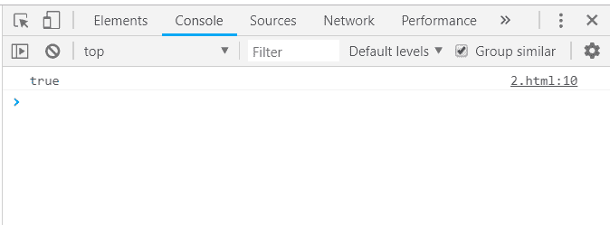
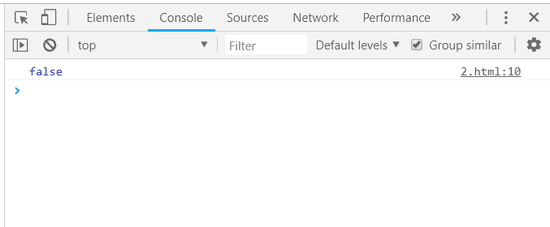
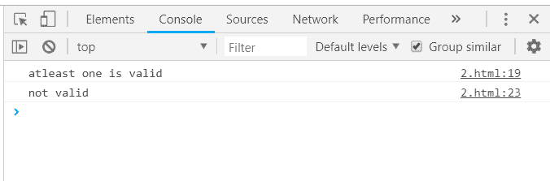
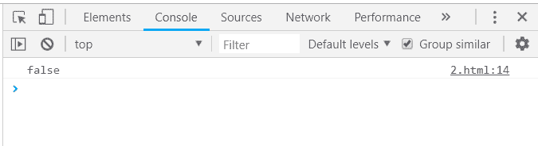

# 下划线. js _。一些功能

> 原文:[https://www . geesforgeks . org/下划线-js-_-some-function/](https://www.geeksforgeeks.org/underscore-js-_-some-function/)

下划线. js 是一个 JavaScript 库，它提供了许多有用的函数，在很大程度上有助于编程，比如映射、过滤、调用等，甚至不使用任何内置对象。
*_。some()* 函数用于查找给定列表中的任何值是否与给定条件匹配。如果至少有一个值满足这个条件，那么输出将是*真*。当所有值都不匹配时，输出将为*假*。

**语法:**

```
_.some(list, [predicate], [context])

```

**参数:**该功能接受三个参数，如上所述，描述如下:

*   **列表:**该参数包含数据列表。
*   **谓词:**此参数用于保存测试条件。
*   **上下文:**该参数包含需要显示的文本。

**返回值:**为真的*(当列表中至少有一个元素满足给定条件时)或为假的*(当所有元素都不满足条件时)。**

****将数组传递给 _。some()函数():** The。_some()函数从列表中逐个获取元素，然后通过对代码执行指定的操作来检查条件。操作是查找数组是否包含任何真元素。**

****示例:****

## **超文本标记语言**

```
**<html>
    <head>
        <title>_.some() function</title>
        <script type="text/javascript" src=
        "https://cdnjs.cloudflare.com/ajax/libs/underscore.js/1.9.1/underscore-min.js" >
        </script>
        <script type="text/javascript" src=
        "https://cdnjs.cloudflare.com/ajax/libs/underscore.js/1.9.1/underscore.js">
        </script>
    </head>       
    <body>
        <script type="text/javascript">
              console.log(_.some([null, 0, 1, false]));
        </script>
    </body>
</html>**
```

****输出:****

****

**在下面的代码中，由于数组包含所有像“0”、“false”、“null”这样的假元素，并且没有真元素，因此输出将是“false”。**

****示例:****

## **超文本标记语言**

```
**<html>
    <head>
        <title>_.some() function</title>
        <script type="text/javascript" src=
        "https://cdnjs.cloudflare.com/ajax/libs/underscore.js/1.9.1/underscore-min.js" >
        </script>
        <script type="text/javascript" src=
        "https://cdnjs.cloudflare.com/ajax/libs/underscore.js/1.9.1/underscore.js">
        </script>
    </head>       
    <body>
        <script type="text/javascript">
             console.log(_.some([null, 0, false]));
        </script>
    </body>
</html>**
```

****输出:****

****

****将数字列表和函数传递给 _。some()函数:**首先，定义列表和列表上需要执行/检查的函数。然后将列表和函数作为参数传递给 _。一些()函数。如果函数中给定的条件满足列表元素的 1，那么输出将是*真*。**

****示例:****

## **超文本标记语言**

```
**<!-- Write HTML code here -->
<html>

<head>
    <script type="text/javascript" src = "https://cdnjs.cloudflare.com/ajax/libs/underscore.js/1.9.1/underscore-min.js" >
    </script>
</head>

<body>
    <script type="text/javascript">
         var values = [1, 2, 3, 4, 5, 6, 7, 8, 9, 10];
         var isEven = function (value) {
               return value % 2 === 0;
        };
        console.log(_.some(values, isEven));
    </script>
</body>

</html>**
```

****输出:****

****

****将结构传递给 _。some()函数:**首先声明数组(这里数组是‘人’)。选择一个需要检查的条件，如这里的“长空气”。记录最终答案。既然，三人的‘龙航’财产是真的那么结果也是*真的*。**

****示例:****

## **超文本标记语言**

```
**<html>
    <head>
        <title>_.some() function</title>
        <script type="text/javascript" src=
        "https://cdnjs.cloudflare.com/ajax/libs/underscore.js/1.9.1/underscore-min.js" >
        </script>
        <script type="text/javascript" src=
        "https://cdnjs.cloudflare.com/ajax/libs/underscore.js/1.9.1/underscore.js">
        </script>
    </head>       
    <body>
        <script type="text/javascript">
             var people = [
                {name: 'sakshi', LongHair: ''},
                {name: 'aishwarya', LongHair: true},
                {name: 'akansha', LongHair: true},
                {name: 'preeti', LongHair: true}
            ],

            hasLongHairs = function (value) {
                return (value.LongHair !== '');
            };

            console.log(_.some(people, hasLongHairs));
        </script>
    </body>
</html>**
```

****输出:****

****

****使用两个 _。一些()一起起作用:**将不同的对象传递给每个 _。一些()函数，然后通过使用像“& &”、“||”、“！”这样的逻辑运算符一起使用以下结果等等。对象 1 和数组 1 至少包含一个真值，因此两个真值的结果也将为真。因此，第一个条件得到满足。object2 为空，arraylist2 也为空，因此它们无效。自从使用“！”每隔 _。一些()函数，所以结果是 2 个真值。**

****示例:****

## **超文本标记语言**

```
**<html>
    <head>
        <title>_.some() function</title>
        <script type="text/javascript" src=
        "https://cdnjs.cloudflare.com/ajax/libs/underscore.js/1.9.1/underscore-min.js" >
        </script>
        <script type="text/javascript" src=
        "https://cdnjs.cloudflare.com/ajax/libs/underscore.js/1.9.1/underscore.js">
        </script>
    </head>       
    <body>
        <script type="text/javascript">
            var listOne = [null,, undefined, {}, 0];
            var listTwo = [];
            var objectOne = {
                property1: null,
                property3: true
            };
            var objectTwo = {};
            if (_.some(listOne) && _.some(objectOne)) 
            {
                console.log("atleast one is valid\n")
            };
            if (!_.some(listTwo) && !_.some(objectTwo)) 
            {
                console.log("not valid\n")
            };
        </script>
    </body>
</html>**
```

****输出:**** 

****

****示例:****

## **超文本标记语言**

```
**<html>
    <head>
        <title>_.some() function</title>
        <script type="text/javascript" src=
        "https://cdnjs.cloudflare.com/ajax/libs/underscore.js/1.9.1/underscore-min.js" >
        </script>
        <script type="text/javascript" src=
        "https://cdnjs.cloudflare.com/ajax/libs/underscore.js/1.9.1/underscore.js">
        </script>
    </head>       
    <body>
        <script type="text/javascript">
            var values = [1, 3, 5, 7, 9];
             var isEven = function (value) {
                   return value % 2 === 0;
            };
            console.log(_.some(values, isEven));
        </script>
    </body>
</html>**
```

****输出:****

****