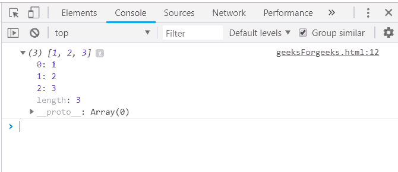
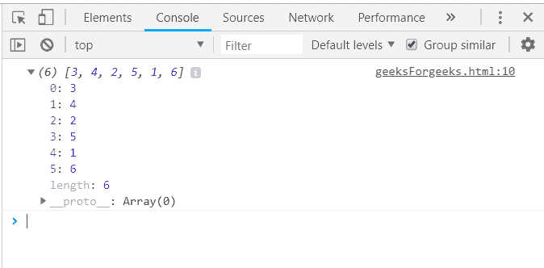
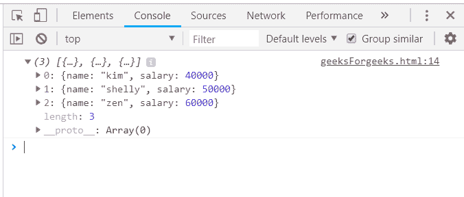
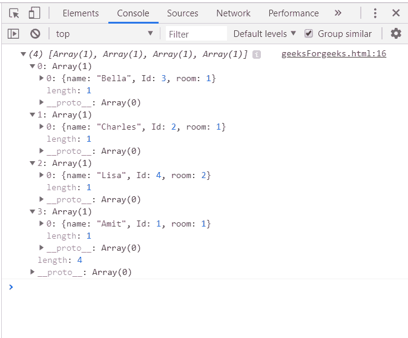

# 下划线. js _。排序功能

> 原文:[https://www . geesforgeks . org/下划线-js-_-sortby-function/](https://www.geeksforgeeks.org/underscore-js-_-sortby-function/)

下划线. js 是一个 JavaScript 库，它提供了许多有用的函数，在很大程度上有助于编程，比如映射、过滤、调用等，甚至不使用任何内置对象。
*_。sortBy()* 函数用于根据给它的函数作为参数，按升序对列表中的所有元素进行排序。给数组传递一个返回数字的函数，它将按升序对数组进行排序并返回一个数组。数组可以是数值，也可以是字符串。

**语法:**

```
_.sortBy(list, iteratee, [context]) 
```

**参数:**该功能接受三个参数，如上所述，描述如下:

*   **列表:**此参数用于设置项目列表。
*   **迭代:**该参数用于保持测试条件。
*   **上下文:**此参数用于显示内容。

**返回值:**返回一个已排序的数组，该数组根据传递的函数进行排序。

**使用简单返回数字的函数:**的。_sortBy()函数从列表中逐个取出元素，并执行函数中给出的指定操作。像这里一样，这个函数只是对列表中的所有元素进行排序。遍历并排序所有元素后，sortBy()函数结束。现在，存储原始数组的变量将包含排序后的数组。

**示例:**

```
<html>
    <head>
        <script type="text/javascript" src=
        "https://cdnjs.cloudflare.com/ajax/libs/underscore.js/1.9.1/underscore.js">
        </script>
    </head>
    <body>
        <script type="text/javascript">
            var array = _.sortBy([2, 3, 1], function(num) {
            return num;
            });
            console.log(array);
        </script>
    </body>
</html>                    
```

**输出:**


**使用 Math.cos()函数:**传递一个数字列表，并对这些数字进行操作，比如取‘cos()’然后比较它们来对数组进行排序。以同样的方式应用所有的“数学”函数，如 tan()、sin()、cot()等，对数组进行排序。

**示例:**

```
<html>
    <head>
        <script type="text/javascript" src=
        "https://cdnjs.cloudflare.com/ajax/libs/underscore.js/1.9.1/underscore.js">
        </script>
    </head>
    <body>
        <script type="text/javascript">
            console.log(_.sortBy([1, 2, 3, 4, 5, 6], function(num) {
                return Math.cos(num); 
            }));    
        </script>
    </body>
</html>                    
```

**输出:**


**使用数组的一个属性:** Apply _。sortBy()方法转换为字符串，并首先声明数组(这里数组是“arr”)。选择数组的一个属性，在此基础上需要像这里的“名称”一样排序。通过传递数组和该属性来记录排序后的数组。

**示例:**

```
<html>
    <head>
        <script type="text/javascript" src=
        "https://cdnjs.cloudflare.com/ajax/libs/underscore.js/1.9.1/underscore.js">
        </script>
    </head>
    <body>
        <script type="text/javascript">
            var arr = [
                 {name: 'kim', salary: 40000}, 
                 {name: 'shelly', salary: 50000},
                 {name: 'zen', salary: 60000}
            ];
            console.log(_.sortBy(arr, 'name'));
        </script>
    </body>
</html>                    
```

**输出:**


**使用 _，反转数组。sortBy()函数:**虽然，该 _。sortBy()函数按升序排序，但仍然在另一个函数“reverse()”和 _”的帮助下反转数组。sortBy()。第一，_。函数将按升序对列表进行排序，然后函数将使数组反转。最后，打印数组。

**示例:**

```
<html>
    <head>
        <script type="text/javascript" src=
        "https://cdnjs.cloudflare.com/ajax/libs/underscore.js/1.9.1/underscore.js">
        </script>
    </head>
    <body>
        <script type="text/javascript">
            var patients = [
                                 [{name: 'Amit', Id: 1, room: 1}],
                                 [{name: 'Lisa', Id: 4, room: 2}],
                                 [{name: 'Charles', Id: 2, room: 1}],
                                 [{name: 'Bella', Id: 3, room: 1}]
                               ];
            var descending = _.sortBy(patients, 'total').reverse();
            console.log(descending);
        </script>
    </body>
</html>                    
```

**输出:**


jQuery 是一个开源的 JavaScript 库，它简化了 HTML/CSS 文档之间的交互，它以其“少写多做”的理念而闻名。
跟随本 [jQuery 教程](https://www.geeksforgeeks.org/jquery-tutorials/)和 [jQuery 示例](https://www.geeksforgeeks.org/jquery-examples/)可以从头开始学习 jQuery。