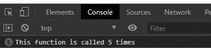

# 下划线. js _。时代()功能

> 原文:[https://www . geesforgeks . org/下划线-js-_-times-function/](https://www.geeksforgeeks.org/underscore-js-_-times-function/)

**下划线. js** 是一个 JavaScript 库，使得对数组、字符串、对象的操作变得更加容易和便捷。
国 **_。times()** 函数在下划线. js 中用于调用该函数特定次数，即函数(f)**【n】**的执行次数。

**注意:**在浏览器中使用下划线功能之前，链接下划线 CDN 是非常必要的。链接下划线. js CDN 链接时，“_”作为全局变量附加到浏览器。

**语法:**

```
_.times(n, iteratee)
```

**参数:**取以下参数:

*   **n:** 它告诉一个函数需要执行多少次。
*   **迭代:**是一个要调用 n 次的函数。

**返回值:**它产生一个返回值数组，这个数组由函数返回。

**例 1:**

## 超文本标记语言

```
<!DOCTYPE html>
<html>

<head>
    <script src=
"https://cdnjs.cloudflare.com/ajax/libs/underscore.js/1.9.1/underscore-min.js">
    </script>
</head>

<body>
    <script>
        let n = 5
        let func = () => {
            console.log(`This function
                is called ${n} times \n`)
        }

        // The _.times function executes
        // the above func function n times
        _.times(n, func);
    </script>
</body>

</html>
```

**输出:**



**例 2:**

## java 描述语言

```
<!DOCTYPE html>
<html>

<head>
    <script src=
"https://cdnjs.cloudflare.com/ajax/libs/underscore.js/1.9.1/underscore-min.js">
    </script>
</head>

<body>
    <script>
        let n = 5;
        let i = 1;
        let func = () => {
            for (i; i <= n; i++) {
                console.log(
        `It is the function call ${i}`)
            }
        }

        // Calling the function func n times.
        let c = _.times(n, func);
        console.log(
"array returned by times function: ", c)
    </script>
</body>

</html>
```

**输出:**

