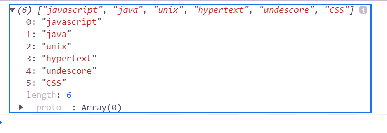

# 下划线. js _。排列功能

> 原文:[https://www . geesforgeks . org/下划线-js-_-toarray-function/](https://www.geeksforgeeks.org/underscore-js-_-toarray-function/)

_。toArray()函数用于从项目列表或在元素上迭代的任何其他数据类型创建一个实数组。

**语法:**

```
_.toArray( list )
```

**参数:**该功能接受如上所述的单个参数，描述如下:

*   **列表:**此参数保存项目列表。

**返回值:**从项目列表中返回一个数组。

**例 1:**

```
<!DOCTYPE html>
<html>

<head>
    <script type="text/javascript" src=
"https://cdnjs.cloudflare.com/ajax/libs/underscore.js/1.9.1/underscore-min.js">
    </script>
</head>

<body>
    <script type="text/javascript">
        (function () {
            var arr = _.toArray(arguments).slice(1);
            console.log(arr);
        })(1, 2, 3, 4);
    </script>
</body>

</html>
```

**输出:**


**例 2:**

```
<!DOCTYPE html>
<html>

<head>
    <script type="text/javascript" src=
"https://cdnjs.cloudflare.com/ajax/libs/underscore.js/1.9.1/underscore-min.js">
    </script>
</head>

<body>
    <script type="text/javascript">
        (function () {
            var arr = _.toArray(arguments);

            console.log(arr);
        })('javascript', 'java', 'unix', 
          'hypertext', 'undescore', 'CSS');
    </script>
</body>

</html>
```

**输出:**
