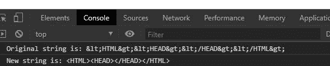
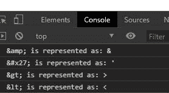

# 下划线. js _。unescape()功能

> 原文:[https://www . geesforgeks . org/下划线-js-_-unescape-function/](https://www.geeksforgeeks.org/underscore-js-_-unescape-function/)

**下划线. js** 是 javascript 中的一个库，使得对数组、字符串、对象的操作变得更加容易和便捷。 **_。unescape()** 函数用于取消一个特殊字符的外观。它的工作原理与 _ 相反。escape()函数。它确实转换“&amp；”到“&”等等。

**语法:**

```
_.unescape(string);
```

**参数:**只取一个参数，即字符串。

**返回:**该函数返回字符串。

**注意:**在浏览器中直接使用该代码时，需要包含一些特价文件。在浏览器中使用下划线功能之前，链接下划线 CDN 是非常必要的。当链接下划线时，“_”作为一个全局变量附加到浏览器中。

为了更好地理解这个函数，下面给出了一些例子。

**例 1:**

```
<!DOCTYPE html> 
<html> 
  <head> 
    <script src =  
"https://cdnjs.cloudflare.com/ajax/libs/underscore.js/1.9.1/underscore-min.js" > 
    </script> 
   </head> 
  <body>
    <script>
      let str="<HTML><HEAD></HEAD></HTML>";
      let str2=_.unescape(str)
      console.log(`Original string is: ${str}`)
      console.log(`New string is: ${str2}`)
    </script>
  </body> 
</html>
```

**输出:**



**例 2:**

```
<!DOCTYPE html> 
<html> 
  <head> 
    <script src =  
"https://cdnjs.cloudflare.com/ajax/libs/underscore.js/1.9.1/underscore-min.js" > 
    </script> 
   </head> 
  <body>
    <script>
      console.log(`& is represented as: ${_.unescape("&")}`)
      console.log(`&#x27; is represented as: ${_.unescape("'")}`)
      console.log(`> is represented as: ${_.unescape(">")}`)
      console.log(`< is represented as: ${_.unescape("<")}`)
    </script>
  </body> 
</html>
```

**输出:**

