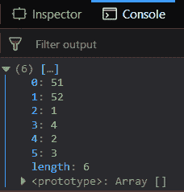
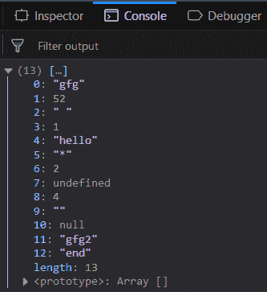
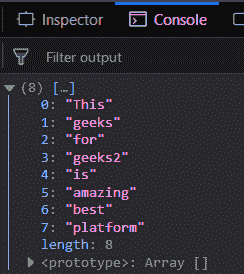
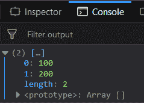

# 下划线. js _。union()函数

> 原文:[https://www . geesforgeks . org/下划线-js-_-union-function/](https://www.geeksforgeeks.org/underscore-js-_-union-function/)

下划线. js 是一个 JavaScript 库，它提供了很多有用的功能，比如映射、过滤、调用等，甚至不使用任何内置对象。
The _。union()函数用于获取 n 个数组，并返回一个新数组，该数组在所有这些数组中都有唯一的项(所有数组的并集)。在新数组中，元素的顺序与所有传递的数组中提到的一样。每个数组的第一次出现只包含在结果数组中。

**语法:**

```
_.union( *arrays )
```

**参数:**该功能接受单参数*数组*，是多个数组列表的集合。数组列表由运算符分隔。

**返回值:**返回一个数组，该数组包含 n 个传递数组中所有元素的唯一元素。

**将数字列表传递给 _。union()函数:**的。_union()函数从列表中逐个取出元素，检查它是否已经出现在结果数组中。如果它存在，那么它就忽略它，否则将它添加到结果数组中。最终结果包含数组的并集。

**示例:**

```
<!DOCTYPE html>
<html>
    <head>
        <script src = 
"https://cdnjs.cloudflare.com/ajax/libs/underscore.js/1.9.1/underscore-min.js" >
        </script>
    </head>
    <body>
        <script type="text/javascript">
            console.log(_.union([51, 52, 1, 4], 
                                [1, 2, 3, 4], 
                                [1, 2]));
        </script>
    </body>
</html>                    
```

**输出:**


**将单词、错误值和数字的组合传递给 _。union()函数:**传递任何类型的元素，无论是数字、单词，甚至是假元素，如空字符串、空值等。union()函数不会区分它们。它宁愿以同样的方式对待每一个元素。进一步的过程将是相同的。

**示例:**

```
<!DOCTYPE html>
<html>
    <head>
        <script src = 
"https://cdnjs.cloudflare.com/ajax/libs/underscore.js/1.9.1/underscore-min.js" >
        </script>
    </head>
    <body>
        <script type="text/javascript">
            console.log(_.union(["gfg", 52, " ", 1, "hello"], 
                                ['*', 2, undefined, 4], 
                                ['', null], 
                                ["gfg2", "end"]));
        </script>
    </body>
</html>                    
```

**输出:**


**将一组字符串传递给 _。union()函数:**将一组字符串传递给这个函数，从而得到结果中传递的所有 n 个数组的公共。处理将以同样的方式进行。只有第二个参数中给出的单词将被排除。

**示例:**

```
<!DOCTYPE html>
<html>
    <head>
        <script src = 
"https://cdnjs.cloudflare.com/ajax/libs/underscore.js/1.9.1/underscore-min.js" >
        </script>
    </head>
    <body>
        <script type="text/javascript">
            console.log(_.union(["This", "geeks"], 
                                ['for', "geeks2", "is", "amazing"],
                                ["This", "is", "best", "platform"]));
        </script>
    </body>
</html>                    
```

**输出:**


**将具有相同元素的数组传递给 _。union()函数:** If 将数组传递给 _。union()函数，并且它们具有相同的元素，那么所有数组的 union 将是第一个数组本身。所有的元素都是公共的，因此将出现在联合后给出的结果中。

**示例:**

```
<!DOCTYPE html>
<html>
    <head>
        <script src = 
"https://cdnjs.cloudflare.com/ajax/libs/underscore.js/1.9.1/underscore-min.js" >
        </script>
    </head>
    <body>
        <script type="text/javascript">
            console.log(_.union([100, 200], 
                                [100, 200], 
                                [100, 200], 
                                [100, 200], 
                                [100, 200], 
                                [100, 200]));
        </script>
    </body>
</html>                    
```

**输出:** 

**注意:**这些命令在 Google 控制台或 Firefox 中无法工作，因为需要添加这些他们没有添加的附加文件。因此，将给定的链接添加到您的 HTML 文件中，然后运行它们。

```
<script type="text/javascript" src = 
"https://cdnjs.cloudflare.com/ajax/libs/underscore.js/1.9.1/underscore-min.js"> 
</script> 
```