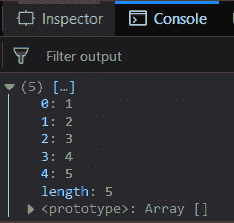
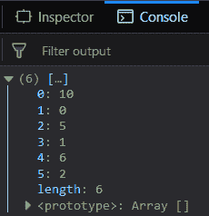
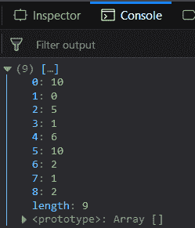
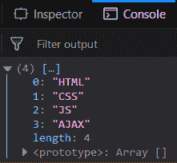

# 下划线. js _。uniq()功能

> 原文:[https://www . geesforgeks . org/下划线-js-_-uniq-function/](https://www.geeksforgeeks.org/underscore-js-_-uniq-function/)

下划线. js 是一个 JavaScript 库，它提供了很多有用的功能，比如映射、过滤、调用等，甚至不使用任何内置对象。
The _。uniq()函数返回不包含重复元素的数组。第一个出现的元素包含在结果数组中。检查数组是否重复的操作。这是通过“===”操作完成的。

**语法:**

```
_.uniq( array, [isSorted], [iteratee] )
```

**参数:**该功能接受以下三个参数:

*   **数组:**此参数用于保存元素的数组。
*   **为分类:**为可选参数。此参数用于为排序数组保留 true。
*   **迭代:**是可选参数，用于保存迭代函数。

**返回值:**返回唯一元素的数组。

**将数字列表传递给 _。uniq()函数:**的。_uniq()函数从列表中逐个获取元素，并通过' === '运算符检查它是否在结果数组(最初为空)中。如果存在，则忽略它并检查下一个元素。否则，因为这是元素的第一次出现，所以它包含在结果数组中。

**示例:**

```
<!DOCTYPE html>
<html>
    <head>
        <script src = 
"https://cdnjs.cloudflare.com/ajax/libs/underscore.js/1.9.1/underscore-min.js" >
        </script>
    </head>
    <body>
        <script type="text/javascript">
            console.log(_.uniq([1, 2, 3, 4, 5, 4, 3, 2, 1]));
        </script>
    </body>
</html>                    
```

**输出:**


**将第二个参数作为 false 传递给 _。uniq()函数:**如果将第二个参数作为 false 与数组一起传递，那么 _。uniq()函数将以与第一个示例类似的方式工作。所有唯一的元素都将出现在结果数组中。

**示例:**

```
<!DOCTYPE html>
<html>
    <head>
        <script src = 
"https://cdnjs.cloudflare.com/ajax/libs/underscore.js/1.9.1/underscore-min.js" >
        </script>
    </head>
    <body>
        <script type="text/javascript">
            console.log(_.uniq([10, 0, 5, 1, 6, 10, 2, 1, 2], false));
        </script>
    </body>
</html>                    
```

**输出:**


**将第二个参数作为 true 传递给 _。uniq()函数:**如果将第二个参数作为 true 与数组一起传递，那么 _。uniq()函数不会以类似的方式工作，而是对数组执行任何操作。因此，结果数组将包含数组中的所有元素，其传递顺序与其在传递数组中出现的顺序相同。

**示例:**

```
<!DOCTYPE html>
<html>
    <head>
        <script src = 
"https://cdnjs.cloudflare.com/ajax/libs/underscore.js/1.9.1/underscore-min.js" >
        </script>
    </head>
    <body>
        <script type="text/javascript">
            console.log(_.uniq([10, 0, 5, 1, 6, 10, 2, 1, 2], true));
        </script>
    </body>
</html>                    
```

**输出:**


**传递文字给 _。uniq()函数:** If 将字符串集传递给 _。uniq()函数，那么它将以与处理数字等类似的方式工作。因此，结果数组将只包含结果数组中所有重复元素的第一次出现。

**示例:**

```
<!DOCTYPE html>
<html>
    <head>
        <script src = 
"https://cdnjs.cloudflare.com/ajax/libs/underscore.js/1.9.1/underscore-min.js" >
        </script>
    </head>
    <body>
        <script type="text/javascript">
            console.log(_.uniq(["HTML", "CSS", "JS",
                        "AJAX", "CSS", "JS", "CSS"]));
        </script>
    </body>
</html>                    
```

**输出:**


**注意:**这些命令在 Google 控制台或 Firefox 中无法工作，因为需要添加这些他们没有添加的附加文件。因此，将给定的链接添加到您的 HTML 文件中，然后运行它们。

```
<script type="text/javascript" src = 
"https://cdnjs.cloudflare.com/ajax/libs/underscore.js/1.9.1/underscore-min.js"> 
</script> 
```