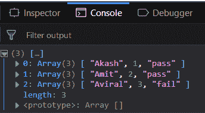
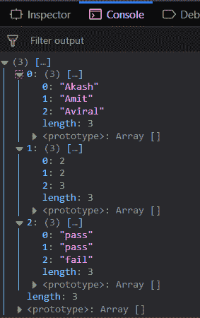
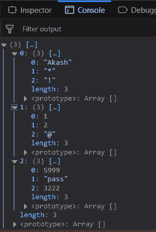
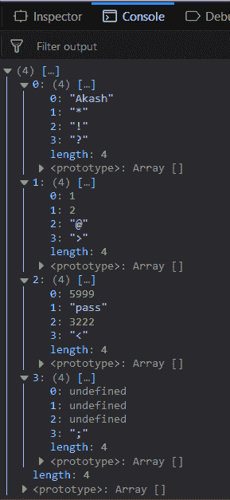

# 下划线. js _。解压()功能

> 原文:[https://www . geesforgeks . org/下划线-js-_-解压-函数/](https://www.geeksforgeeks.org/underscore-js-_-unzip-function/)

下划线. js 是一个 JavaScript 库，它提供了许多有用的功能，如映射、过滤、调用等，甚至不使用任何内置对象。
The _。unzip()函数用于将不同数组中相同类型的元素组合成一个数组。它将每个传递的数组元素逐一匹配到下一个传递的数组元素。当一个以上的同类数组(一种类型的元素，如数字、作品、特殊字符等)通过将每个元素与下一个数组中相应的元素相匹配来连接所有数组时，使用它。它可以有许多数组作为参数。结果将包含与最大数组的元素数相同的数组数。它与 _。zip()函数。

**语法:**

```
_.unzip( *arrays )
```

**参数:**该功能接受单参数*数组*，用于保存数组元素。

**返回值:**返回结果数组。

**将同构数组传递给 _。unzip()函数:**的。函数的作用是:接受第一个数组中的元素，并生成结果数组的第一个元素。然后，它从第二个数组中获取元素，并将其映射为第一个元素的第二个属性。这样做，直到所有数组的第一个元素都被覆盖。然后它形成结果数组的第二个元素。这种情况一直持续到所有元素都被覆盖。

**示例:**

```
<!DOCTYPE html>
<html>
    <head>
        <script src = 
"https://cdnjs.cloudflare.com/ajax/libs/underscore.js/1.9.1/underscore-min.js" >
        </script>
    </head>
    <body>
        <script type="text/javascript">
            console.log(_.unzip([['Akash', 'Amit', 'Aviral'], 
                                 [01, 02, 03], 
                                 ['pass', 'pass', 'fail']])
            );
        </script>
    </body>
</html>                    
```

**输出:**


**将异类数组传递给 _。unzip()函数:**传递一个异构数组，即在单个数组中包含各种元素的数组。_。unzip()函数也会以同样的方式工作。过程是相同的，但输出会有所不同。现在它将在结果中形成同质数组。

**示例:**

```
<!DOCTYPE html>
<html>
    <head>
        <script src = 
"https://cdnjs.cloudflare.com/ajax/libs/underscore.js/1.9.1/underscore-min.js" >
        </script>
    </head>
    <body>
        <script type="text/javascript">
            console.log(_.unzip([['Akash', 02, 'pass'], 
                                 ['Amit', 02, 'pass'],
                                 ['Aviral', 03, 'fail']])
            );
        </script>
    </body>
</html>                    
```

**输出:**


**绘制 _ 中元素的不同种类。unzip()函数**将不同种类的元素传递给 _。解压缩功能。这一次的过程也是一样的，但是结果不会是一个同构的数组，而是一个异构的数组，一串单词作为第一个数组的第一个元素传递，但是一串特殊的字符作为第二个数组的第一个元素传递。

**示例:**

```
<!DOCTYPE html>
<html>
    <head>
        <script src = 
"https://cdnjs.cloudflare.com/ajax/libs/underscore.js/1.9.1/underscore-min.js" >
        </script>
    </head>
    <body>
        <script type="text/javascript">
            console.log(_.unzip([['Akash', 01, 5999], 
                                 ['*', 02, 'pass'], 
                                 ['!', '@', 3222]])
            );
        </script>
    </body>
</html>                    
```

**输出:**


**将大小不等的数组传递给 _。unzip()函数:**可以传递大小不等的数组，但这会导致结果数组中出现未定义的值。这是因为将在其余数组中找到匹配的元素的数量将被视为单个数组，但是如果它们没有找到任何匹配，那么它们将具有“未定义”的位置。但这将顺利工作，不会产生任何错误。

**示例:**

```
<!DOCTYPE html>
<html>
    <head>
        <script src = 
"https://cdnjs.cloudflare.com/ajax/libs/underscore.js/1.9.1/underscore-min.js" >
        </script>
    </head>
    <body>
        <script type="text/javascript">
            console.log(_.unzip([['Akash', 01, 5999], 
                                 ['*', 02, 'pass'], 
                                 ['!', '@', 3222],
                                 ['?', '>', '<', ';']])
            );
        </script>
    </body>
</html>                    
```

**输出:**


**注意:**这些命令在 Google 控制台或 Firefox 中无法工作，因为需要添加这些他们没有添加的附加文件。因此，将给定的链接添加到您的 HTML 文件中，然后运行它们。

```
<script type="text/javascript" src = 
"https://cdnjs.cloudflare.com/ajax/libs/underscore.js/1.9.1/underscore-min.js"> 
</script> 
```