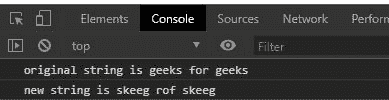

# 下划线. js _。值()函数

> 原文:[https://www . geesforgeks . org/下划线-js-_-值-函数/](https://www.geeksforgeeks.org/underscore-js-_-value-function/)

**下划线. js** 是一个 JavaScript 库，使得对数组、字符串、对象的操作变得更加容易和便捷。
国 **_。value()** 函数用于提取包裹对象的值。该功能主要与 JavaScript 中的**链**功能配合使用。

**注意:**在浏览器中使用下划线功能之前，链接下划线 CDN 是非常必要的。链接下划线时，“_”作为全局变量附加到浏览器。

**语法:**

```
_.chain(obj).value()
```

**参数:**此功能不接受任何参数。它被不同的功能所链接。".value()”用于提取对象的值，即数组、字符串等。**返回值:**返回对象类型对象的值。如果对象是数组，则返回一个数组；如果对象是字符串，则返回一个字符串，依此类推。

**例 1:**

```
<!DOCTYPE html>
<html>

<head>
    <script src=
"https://cdnjs.cloudflare.com/ajax/libs/underscore.js/1.9.1/underscore-min.js">
    </script>
</head>

<body>
    <script>
        let arr = ["c", "d", "a", "b"];
        console.log(`original array is ${arr}`);

        // Wrapped object is array so 
        // its values is returned
        let newArr = _.chain(arr).sort().value();

        // Changes made in original array.
        console.log(`original array is ${arr}`);
        console.log(`new array is ${newArr}`);
    </script>
</body>

</html>
```

**输出:**


**例 2:**

```
<!DOCTYPE html>
<html>

<head>
    <script src=
"https://cdnjs.cloudflare.com/ajax/libs/underscore.js/1.9.1/underscore-min.js">
    </script>
</head>

<body>
    <script>
        let str = "geeks for geeks"
        console.log(`original string is ${str}`);

        // Wrapped object is str so its
        // values is returned
        let newstr = _.chain(str).toArray()
                .reverse().join("").value();

        // Printing the new string
        console.log(`new string is ${newstr}`);
    </script>
</body>

</html>
```

**输出:**

