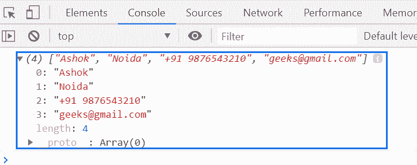

# 下划线. js _。值()函数

> 原文:[https://www . geesforgeks . org/下划线-js-_-值-函数/](https://www.geeksforgeeks.org/underscore-js-_-values-function/)

**_。values()函数**用于返回对象元素所有值的列表。

**语法:**

```
_.values( object )
```

**参数:**该函数接受一个参数，如上所述，如下所述:

*   **对象:**包含保存键值对元素的对象元素。

**返回值:**返回对象元素所有值的列表。

**例 1:**

```
<!DOCTYPE html>
<html>

<head>
    <script type="text/javascript" 
            src=
"https://cdnjs.cloudflare.com/ajax/libs/underscore.js/1.9.1/underscore-min.js">
    </script>
</head>

<body>
    <script type="text/javascript">

        var obj = {
            Company: "GeeksforGeeks",
            Address: "Noida",
            Contact: "+91 9876543210",
            Email: "abc@gfg.com"
        }
        console.log(_.values(obj));
    </script>
</body>

</html>
```

**输出:**


**例 2:**

```
<!DOCTYPE html>
<html>

<head>
    <script type="text/javascript" 
            src=
"https://cdnjs.cloudflare.com/ajax/libs/underscore.js/1.9.1/underscore-min.js">
    </script>
</head>

<body>
    <script type="text/javascript">

        var key = _.values({
            Name: "Ashok",
            Address: "Noida",
            Mobile: "+91 9876543210",
            Email: "geeks@gmail.com"
        });

        console.log(key);
    </script>
</body>

</html>
```

**输出:**
