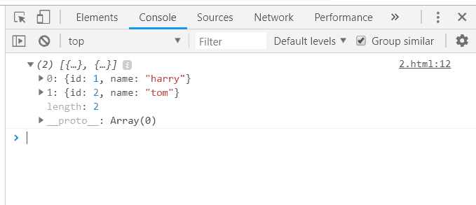
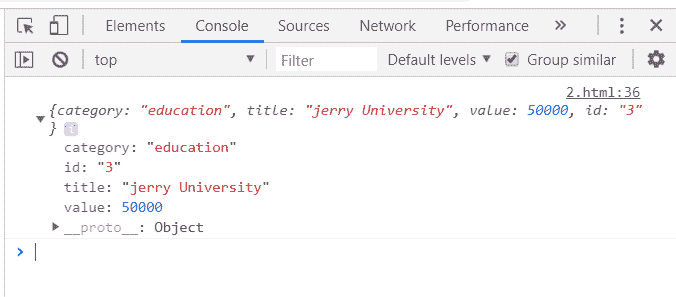
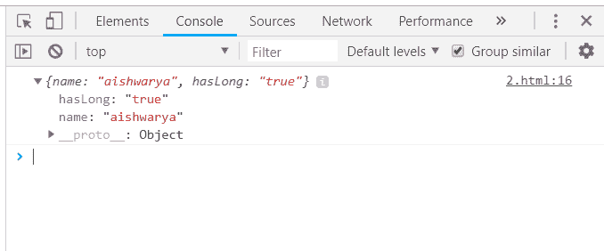
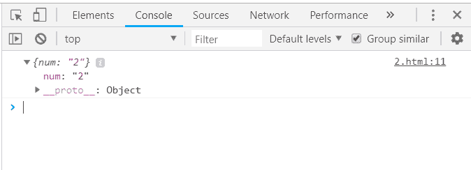

# 下划线. js _。何处功能

> 原文:[https://www . geesforgeks . org/下划线-js-_-where-where-function/](https://www.geeksforgeeks.org/underscore-js-_-wherewhere-function/)

下划线. js 是一个 JavaScript 库，它提供了许多有用的函数，在很大程度上有助于编程，比如映射、过滤、调用等，甚至不使用任何内置对象。

*_。函数的作用是:列出与给定属性匹配的所有元素。_。函数的作用是:在整个栏目列表中搜索一个内容。将显示包含内容的部分。*

**语法:**

```
_.findWhere(list, properties) 

```

**参数:**需要两个参数:

*   **列表:**该参数包含项目列表。
*   **属性:**该参数包含测试条件。

**返回值:**返回从列表中选择的元素的详细信息。只有第一个匹配的元素将作为输出给出。

**相差 _。findWhere()和 _。其中()函数:**这两个函数都取一个数组名和要匹配的属性，但取 _。函数显示所有匹配项，而。函数只匹配第一个匹配项。

**在数组中搜索属性:**该。函数的作用是:一个接一个地获取数组元素，并且匹配给定的属性是否相同。如果属性匹配，它将显示该特定元素的其余详细信息。属性第一次匹配后。findWhere()函数结束。它只显示第一个匹配。

**示例:**

## 超文本标记语言

```
<html>
    <head>
        <title>_.findWhere() function</title>
        <script type="text/javascript" src=
        "https://cdnjs.cloudflare.com/ajax/libs/underscore.js/1.9.1/underscore-min.js" >
        </script>
    </head>       
    <body>
        <script type="text/javascript">
            var users = [{id: 1, name: "harry"}, {id: 2, name: "jerry"}];
            _.findWhere(users, {id:2}).name = 'tom';
            console.log(users);
        </script>
    </body>  
</html>
```

**输出:**



**将具有多个不同属性的元素列表传递给 _。findWhere()函数:**首先，用所有元素及其特定属性声明数组。然后传递数组名和需要匹配的属性。findWhere()函数。所有其余属性将显示为该特定元素的输出。

**示例:**

## 超文本标记语言

```
<html>
    <head>
        <title>_.findWhere() function</title>
        <script type="text/javascript" src=
        "https://cdnjs.cloudflare.com/ajax/libs/underscore.js/1.9.1/underscore-min.js" >
        </script>
    </head>       
    <body>
        <script type="text/javascript">
            var goal  = [
                {
                    "category" : "other",
                    "title" : "harry University",
                    "value" : 50000,
                    "id":"1"
                },
                {
                    "category" : "traveling",
                    "title" : "tommy University",
                    "value" : 50000,
                    "id":"2"
                },
                {
                    "category" : "education",
                    "title" : "jerry University",
                    "value" : 50000,
                    "id":"3"
                },
                {    
                    "category" : "business",
                    "title" : "Charlie University",
                    "value" : 50000,
                    "id":"4"
                }
            ]
            console.log(_.findWhere(goal, {category: "education"}));
        </script>
    </body>  
</html>
```

**输出:**



**将“true/false”作为属性的数组传递给 _。findWhere()函数:**首先声明数组(这里数组是‘人’)。它是被定义为“真”或“假”的属性(这里是“hasLong”)。选择一个条件进行检查，如这里的“hasLongHairs”。Console.log 显示最终答案。

**示例:**

## 超文本标记语言

```
<html>
    <head>
        <title>_.findWhere() function</title>
        <script type="text/javascript" src=
        "https://cdnjs.cloudflare.com/ajax/libs/underscore.js/1.9.1/underscore-min.js" >
        </script>
    </head>       
    <body>
        <script type="text/javascript">
            var people = [
                {"name": "sakshi", "hasLong": "false"},
                {"name": "aishwarya", "hasLong": "true"},
                {"name": "akansha", "hasLong": "true"},
                {"name": "preeti", "hasLong": "true"}
            ]
         console.log(_.findWhere(people, {hasLong: "true"}));
        </script>
    </body>
</html>
```

**输出:**



**将数字数组作为属性传递给 _。函数的作用是:**它也遵循同样的过程，首先声明一个包含所有属性的数组，然后给出数组名和匹配的属性。findWhere()函数。

**示例:**

## 超文本标记语言

```
<html>
    <head>
        <title>_.findWhere() function</title>
        <script type="text/javascript" src=
        "https://cdnjs.cloudflare.com/ajax/libs/underscore.js/1.9.1/underscore-min.js" >
        </script>
    </head>       
    <body>
        <script type="text/javascript">
             var users = [{"num":"1"}, 
                          {"num":"2"}, 
                          {"num":"3"}, 
                          {"num":"4"}, 
                          {"num":"5"}];
        console.log(_.findWhere(users, {num:"2"}));
        </script>
    </body>

</html>
```

**输出:**

