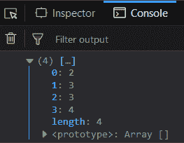
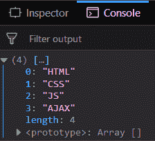
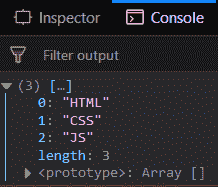

# 下划线. js _。不带()功能

> 原文:[https://www . geesforgeks . org/下划线-js-_-不带-function/](https://www.geeksforgeeks.org/underscore-js-_-without-function/)

下划线. js 是一个 JavaScript 库，它提供了很多有用的功能，比如映射、过滤、调用等，甚至不使用任何内置对象。
The _。函数的作用是:返回一个数组的副本，该副本包含除值以外的所有数组。

**语法:**

```
_.without( array, *values )
```

**参数:**该函数接受两个参数，如下所示:

*   **数组:**此参数用于保存数组元素列表。
*   **值:**该参数用于保存需要从数组列表中删除的值。

**返回值:**返回一个数组的副本，没有提到传递的数组的元素。

**将数字列表传递给 _。不带()函数:**的。函数的作用是:从列表中一个接一个地取出元素，并检查它是否是第二个参数中提到的不需要的元素。如果是，则它不包括在结果数组中，否则它包括在内。

**示例:**

```
<!DOCTYPE html>
<html>
    <head>
        <script src = 
"https://cdnjs.cloudflare.com/ajax/libs/underscore.js/1.9.1/underscore-min.js" >
        </script>
    </head>
    <body>
        <script type="text/javascript">
            console.log(_.without([0, 1, 2, 3, 0, 1, 3, 4], 0, 1));
        </script>
    </body>
</html>                    
```

**输出:**


**将伪元素传递给 _。不带()函数:**的。_ 不带()函数的响应类似，从列表中一个接一个地取出元素，并检查它是否是第二个参数中提到的不必要的元素。如果是，则它不包括在结果数组中，否则它包括在内。不管它是不是真的元素，都没有关系。这意味着 _。函数的作用是:在处理过程中，对所有元素一视同仁。

**示例:**

```
<!DOCTYPE html>
<html>
    <head>
        <script src = 
"https://cdnjs.cloudflare.com/ajax/libs/underscore.js/1.9.1/underscore-min.js" >
        </script>
    </head>
    <body>
        <script type="text/javascript">
            console.log(_.without([0, 1, 2, 4, undefined, null,
                            3, 1, 4, 0, "", ''], 0, null, '')
            );
        </script>
    </body>
</html>                    
```

**输出:**


**将区分大小写的元素(大写/小写)传递给 _。不带()函数:**的。_ 不带()函数也将如此。在这个函数中，以区分大小写(大写)的格式传递给定数组中的元素。它不排除在结果数组之外，这意味着 _。函数区分大小写。

**示例:**

```
<!DOCTYPE html>
<html>
    <head>
        <script src = 
"https://cdnjs.cloudflare.com/ajax/libs/underscore.js/1.9.1/underscore-min.js" >
        </script>
    </head>
    <body>
        <script type="text/javascript">
            console.log(_.without(["HTML", "CSS", "JS", "AJAX"], "ajax"));
        </script>
    </body>
</html>                    
```

**输出:**


**将相同情况下的元素传递给 _。不带()函数:**传递传递的数组中提到的第二个参数，然后元素(这里是“AJAX”)被排除。

**示例:**

```
<!DOCTYPE html>
<html>
    <head>
        <script src = 
"https://cdnjs.cloudflare.com/ajax/libs/underscore.js/1.9.1/underscore-min.js" >
        </script>
    </head>
    <body>
        <script type="text/javascript">
            console.log(_.without(["HTML", "CSS", "JS", "AJAX"], "AJAX"));
        </script>
    </body>
</html>                    
```

**输出:**


**注意:**这些命令在 Google 控制台或 Firefox 中无法工作，因为需要添加这些他们没有添加的附加文件。因此，将给定的链接添加到您的 HTML 文件中，然后运行它们。

```
<script type="text/javascript" src = 
"https://cdnjs.cloudflare.com/ajax/libs/underscore.js/1.9.1/underscore-min.js"> 
</script> 
```