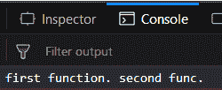
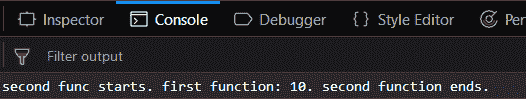
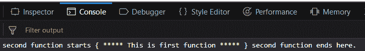
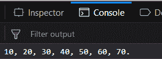

# 下划线. js _。包裹()功能

> 原文:[https://www . geesforgeks . org/下划线-js-_-wrap-function/](https://www.geeksforgeeks.org/underscore-js-_-wrap-function/)

下划线. js 是一个 JavaScript 库，它提供了很多有用的功能，比如映射、过滤、调用等，甚至不使用任何内置对象。
The _。wrap()用于将一个函数包装在另一个函数中。这意味着调用第一个调用函数(一个调用其主体中另一个函数的函数)，然后执行被调用的函数。如果调用函数没有调用被调用函数，那么第二个函数将不会被执行。

**语法:**

```
_.wrap( function, wrapper )
```

**参数:**该功能接受两个参数，如下所示:

*   **功能:**此参数用于保存功能名称。
*   **包装器:**该参数用于保存包装第一个功能的包装器功能。

**返回值:**返回过程中涉及的两个函数的输出。

**不传递 _ 的两个函数的参数。wrap()函数:**调用传递给 console.log()函数的函数。该函数体包含 _。调用另一个函数的 wrap()函数。然后执行另一个函数体，最后控制返回到被调用的函数。

**示例:**

```
<!DOCTYPE html>
<html>

<head>
    <script src = 
"https://cdnjs.cloudflare.com/ajax/libs/underscore.js/1.9.1/underscore-min.js" >
    </script>
</head>

<body>
    <script type = "text/javascript">
        var func1 = function() { return "first function. "; };

        func2 = _.wrap(func1, function(func) {
            return func() + "second func. ";
        });

        console.log(func2());
    </script>
</body>

</html>                    
```

**输出:**


**将参数传递给第二个函数 _。wrap()函数:**将参数从第一个函数定义传递给第二个函数。在定义中，第二个函数的参数将通过在括号内给参数加上双引号(" ")来传递。该函数将像前面一样工作，首先，调用的第一个函数将被执行，然后第一个函数将被执行。

**示例:**

```
<!DOCTYPE html>
<html>

<head>
    <script src = 
"https://cdnjs.cloudflare.com/ajax/libs/underscore.js/1.9.1/underscore-min.js" >
    </script>
</head>

<body>
    <script type="text/javascript">
        var func1 = function(a) { 
            return "first function: " + a + "."; 
        };

        func2 = _.wrap(func1, function(func) {
            return "second func starts. " 
            + func("10") + " second function ends.";
        });

        console.log(func2());
    </script>
</body>

</html>                    
```

**输出:**


**将特殊字符作为参数传递给第二个函数 _。wrap()函数:**将特殊字符传递给第二个函数，然后传递给 _。wrap()函数将以同样的方式工作。它把特殊角色当成正常角色，然后以同样的方式工作。第一个函数将被调用，然后它的主体将被执行。之后，当第一个函数在第二个函数内部被调用时，第二个函数体将被执行。

**示例:**

```
<!DOCTYPE html>
<html>

<head>
    <script src = 
"https://cdnjs.cloudflare.com/ajax/libs/underscore.js/1.9.1/underscore-min.js" >
    </script>
</head>

<body>
    <script type="text/javascript">
        var func1 = function(a) { return a; };

        func2 = _.wrap(func1, function(func) {
            return "second function starts { " 
            + func("***** This is first function *****") 
            + " } second function ends here.";
        });

        console.log(func2());
    </script>
</body>

</html>                    
```

**输出:**


**将数字作为参数传递给 _。wrap()函数:**第二个函数也会像考虑字符一样考虑数字。这将给出相应的输出。

**示例:**

```
<!DOCTYPE html>
<html>

<head>
    <script src = 
"https://cdnjs.cloudflare.com/ajax/libs/underscore.js/1.9.1/underscore-min.js" >
    </script>
</head>

<body>
    <script type = "text/javascript">
        var func1 = function(a) { return a + ", "; };

        func2 = _.wrap(func1, function(func) {
            return "10, 20, " + func("30, 40, 50") + " 60, 70.";
        });

        console.log(func2());
    </script>
</body>

</html>                    
```

**输出:**


**注意:**这些命令在 Google 控制台或 Firefox 中无法工作，因为需要添加这些他们没有添加的附加文件。因此，将给定的链接添加到您的 HTML 文件中，然后运行它们。

```
<script type="text/javascript" src = 
"https://cdnjs.cloudflare.com/ajax/libs/underscore.js/1.9.1/underscore-min.js"> 
</script> 
```