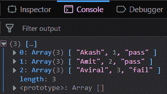
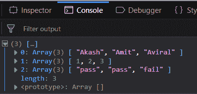
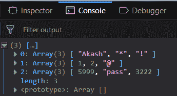
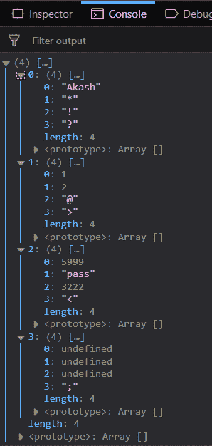

# 下划线. js _。zip()功能

> 原文:[https://www.geeksforgeeks.org/underscore-js-_-zip-function/](https://www.geeksforgeeks.org/underscore-js-_-zip-function/)

下划线. js 是一个 JavaScript 库，它提供了很多有用的功能，比如映射、过滤、调用等，甚至不使用任何内置对象。
The _。函数的作用是:将每个传递的数组元素与下一个传递的数组元素相匹配。当一个以上的同类数组(一种类型的元素，如数字、函数、特殊字符等)通过将每个元素与下一个数组中相应的元素相匹配来连接所有数组时，使用该方法。它可以有许多数组作为参数。结果将包含与最大数组中的元素数量相同的数组数量。

**语法:**

```
_.zip( *arrays )
```

**参数:**该函数接受包含数组元素的单参数*数组*。

**返回值:**返回结果数组。

**将同构数组传递给 _。zip()函数:**该。_zip()函数接受第一个数组中的元素，并生成结果数组的第一个元素。然后，它从第二个数组中获取元素，并将其映射为第一个元素的第二个属性。这个过程一直持续到数组的第一个元素被覆盖。然后它形成结果数组的第二个元素。它一直运行到所有元素都被覆盖。

**示例:**

```
<!DOCTYPE html>
<html>
    <head>
        <script src = 
"https://cdnjs.cloudflare.com/ajax/libs/underscore.js/1.9.1/underscore-min.js" >
        </script>
    </head>
    <body>
        <script type="text/javascript">
            console.log(_.zip(['Akash', 'Amit', 'Aviral'], 
                              [01, 02, 03], 
                              ['pass', 'pass', 'fail'])
            );
        </script>
    </body>
</html>                    
```

**输出:**


**将异类数组传递给 _。zip()函数:**传递一个异构数组，即在单个数组中包含各种元素。_。zip()函数将以同样的方式工作。过程是相同的，但输出会有所不同。现在它将在结果中形成同质数组。

**示例:**

```
<!DOCTYPE html>
<html>
    <head>
        <script src = 
"https://cdnjs.cloudflare.com/ajax/libs/underscore.js/1.9.1/underscore-min.js" >
        </script>
    </head>
    <body>
        <script type="text/javascript">
            console.log(_.zip(['Akash', 02, 'pass'], 
                              ['Amit', 02, 'pass'], 
                              ['Aviral', 03, 'fail'])
            );
        </script>
    </body>
</html>                    
```

**输出:**


**在 _ 中映射不同种类的元素。zip()函数:**将不同种类的元素传递给 _。zip 功能。这一次的过程将是相同的，但结果不会是一个同构阵列，而是一个异构阵列。

**示例:**

```
<!DOCTYPE html>
<html>
    <head>
        <script src = 
"https://cdnjs.cloudflare.com/ajax/libs/underscore.js/1.9.1/underscore-min.js" >
        </script>
    </head>
    <body>
        <script type="text/javascript">
            console.log(_.zip(['Akash', 01, 5999], 
                              ['*', 02, 'pass'], 
                              ['!', '@', 3222])
            );
        </script>
    </body>
</html>                    
```

**输出:**


**将大小不等的数组传递给 _。zip()函数:**传递大小不等的数组，但这将导致结果数组中出现未定义的值。这是因为将在其余数组中找到匹配的元素的数量将被视为单个数组，但是如果它们没有找到任何匹配，那么它们将具有“未定义”的位置。但这将顺利工作，不会产生任何错误。

**示例:**

```
<!DOCTYPE html>
<html>
    <head>
        <script src = 
"https://cdnjs.cloudflare.com/ajax/libs/underscore.js/1.9.1/underscore-min.js" >
        </script>
    </head>
    <body>
        <script type="text/javascript">
            console.log(_.zip(['Akash', 01, 5999],
                              ['*', 02, 'pass'],
                              ['!', '@', 3222],
                              ['?', '>', '<', ';'])
            );
        </script>
    </body>
</html>                    
```

**输出:**


**注意:**这些命令在 Google 控制台或 Firefox 中无法工作，因为需要添加这些他们没有添加的附加文件。因此，将给定的链接添加到您的 HTML 文件中，然后运行它们。

```
<script type="text/javascript" src = 
"https://cdnjs.cloudflare.com/ajax/libs/underscore.js/1.9.1/underscore-min.js"> 
</script> 
```