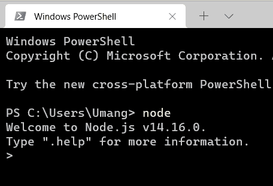
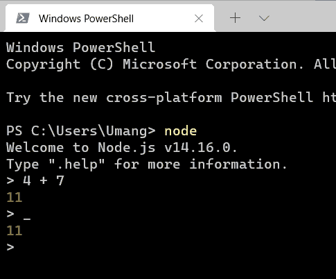
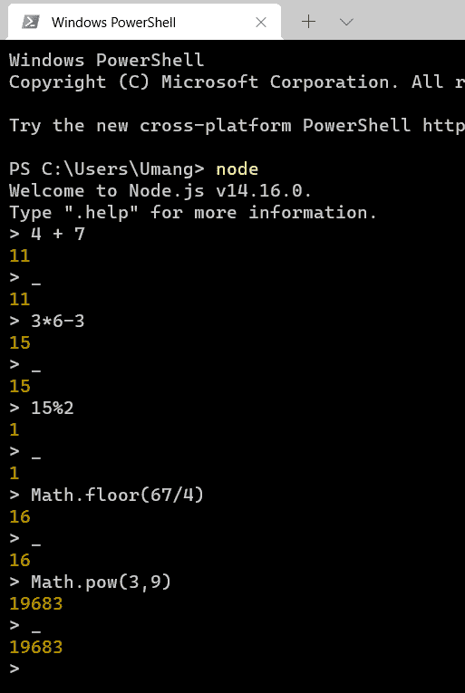
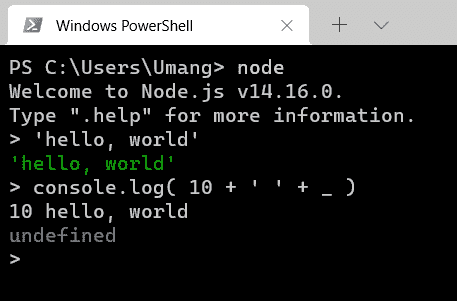
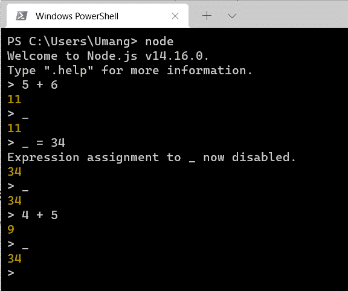

# 下划线变量在 REPL 有什么用？

> 原文:[https://www . geesforgeks . org/repl 中下划线变量的用法是什么/](https://www.geeksforgeeks.org/what-is-the-use-of-underscore-variable-in-repl/)

在之前的 [<u>Node.js REPL</u>](https://www.geeksforgeeks.org/node-js-repl-read-eval-print-loop/) 帖子中，我们已经讨论了什么是 Node.js REPL 以及如何在您的命令提示符下使用它。我们还讨论了如何执行算术运算，如何使用节点库函数，以及如何在 REPL 使用循环。在本文中，我们将讨论下划线(_)变量在 Node 中的用途。JS REPL。

**REPL 的下划线变量:***REPL 的下划线变量是一个特殊的变量，用于存储最后一个求值表达式的结果。*这意味着您可以使用这个变量访问最后一个表达式的结果。让我们看一个例子来更好地理解。

**第一步:**要启动 REPL 环境，打开终端，写*节点。*你会看到下面的画面。

REPL 环境

**第 2 步:**现在，评估任何表达式，例如 4 + 7。你会像预期的那样在屏幕上看到 11。现在只要给一个下划线，然后点击回车。你会再次看到 11。因为 11 是最后一个表达式的结果，所以下划线变量返回 11。

REPL 4+7 评估

**第三步:**我们来评估另一个表达式 3*6-4。再次键入下划线并查看结果。你可以计算任何表达式。继续尝试评估一些表达式。

**第 4 步:**下划线变量不仅限于数学表达式。您可以存储任何数据类型的结果。这里有一个字符串的例子。

带字符串的下划线

**注:**

1.  如果我们试图在启动 REPL 之后访问下划线变量，我们将得到未定义的结果。
2.  为下划线变量显式设置任何其他值都将禁用此行为。这仅适用于节点版本 6.x 及更高版本。

禁用下划线功能